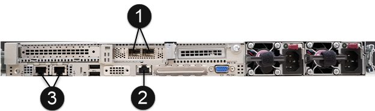

= 執行必要的安裝工作
:allow-uri-read: 
:icons: font
:imagesdir: ../media/

[role="lead"]
安裝SolidFire 完EESDS之前、請務必執行必要的檢查、並確認您的環境符合組態、IP定址和網路需求。

.<strong>安裝所需的硬體</strong>
* 安裝支援的伺服器。請參閱 https://mysupport.netapp.com/matrix/imt.jsp?components=97283;&solution=1757&isHWU#welcome["NetApp互通性對照表（需登入）"^] 以取得更多資訊。
* 請確定您的硬體組態已達到平衡、而且所有通道均已填入。如需最大化頻寬的詳細資訊、請參閱 https://kb.netapp.com/Advice_and_Troubleshooting/Data_Storage_Software/SolidFire_Enterprise_SDS/How_to_balance_memory_and_maximize_bandwidth_for_your_hardware_configurations["知識庫文章"^] （需要登入）。

.<strong>設定主機（節點）</strong>
* 根據中所列的支援版本來安裝RHEL https://mysupport.netapp.com/matrix/imt.jsp?components=97283;&solution=1757&isHWU#welcome["NetApp互通性對照表（需登入）"^]。
* 設定網路時間傳輸協定（NTP）伺服器、以搭配網路中的所有主機使用。
* 選取安裝目的地時、請選取選項按鈕以手動設定檔案系統分割區。在「*手動分割*」頁面上、使用*+*和*-*按鈕移除任何現有的分割區、然後建立新的分割區並依照此處列出的建議調整其大小。使用預設的LVM分割配置可讓您在需要時輕鬆調整大小。
+

NOTE: 根據預設、RHEL會選擇「xfs」作為您手動建立之分割區的預設檔案系統。您應該將其變更為「ext4」、除了「/boot」和「shwap」分割區之外。您的「/boot」分割區應該使用「ext2」。

+
如果您的SATA磁碟為250GB、請遵循下列建議的分割區。如果您的SATA磁碟有更多空間、您可以增加/opt和/var磁碟分割區大小。

+
[cols="2*"]
|===
| 分割區 | 尺寸 

 a| 
/boot
 a| 
1GB

 a| 
/opt
 a| 
50GB

 a| 
/var
 a| 
50GB

 a| 
切換
 a| 
4GB

 a| 
/home
 a| 
5GB

 a| 
/
 a| 
最少10Gb

 a| 
/usr
 a| 
最少10Gb

|===
+

NOTE: 任何程序都不會使用「/sdb"磁碟。

* 停用RAID for /boot。
* 在「軟體選擇」畫面中、選取要安裝的特定套件、然後根據RHEL版本選取*「伺服器*」或*「基礎架構伺服器*」。
* 第一次開機之後、請執行下列動作：
+
** 安裝Red Hat訂購管理程式、並啟用下列儲存庫：
+
[listing]
----

rhel-7-server-ansible-2.9-rpms
rhel-7-server-optional-rpms
rhel-7-server-extras-rpms
----
** 在節點上啟用SSH。
** 如果您要停用IPv6、請依照本節所述的步驟進行 https://kb.netapp.com/Advice_and_Troubleshooting/Data_Storage_Software/SolidFire_Enterprise_SDS/How_to_disable_IPv6_for_SolidFire_eSDS["知識庫文章（需要登入）"^]。

.<strong>安裝所需的軟體</strong>
* 安裝Ansible、Git、Podman和Python 3.0。
+

NOTE: 對於元素123、支援的Podman版本為1.1.4。

.<strong>驗證您的組態是否符合NetApp&#8217;安裝SolidFire RESTESDS</strong>的要求
* 使用SolidFire 中所列的「功能不均」組態 https://mysupport.netapp.com/matrix/#welcome["NetApp互通性對照表工具IMT （不含）"] 作為參考。
+

IMPORTANT: 如果您聯絡NetApp支援部門以尋求SolidFire 有關支援方面的協助、則支援部門會先確認您的平台是否符合SolidFire 《支援》所列的《支援》參考組態。IMT如果Support判定您的基礎平台不符合參考組態、Support將會引導您將不相容的韌體、軟體及/或硬體元件與IMT 正確版本的更新程式進行對齊。

* 針對SolidFire 不符合的ESDS執行法規遵循檢查。
+
.. 執行「Ansible－galletical install」命令、安裝「na_solidfire_SDs_Compliance」角色。
+
[listing]
----
ansible-galaxy install git+https://github.com/NetApp-Automation/nar_solidfire_sds_compliance.git
----
+
您也可以從複製角色、手動安裝角色 https://github.com/NetApp-Automation["NetApp GitHub儲存庫"^] 並將角色放在「~/.Ansible /roses'」目錄中。NetApp提供README檔案、其中包含如何執行角色的相關資訊。

+

NOTE: 請務必下載最新版本的角色。

.. 將您下載的角色往上移一個目錄、從其中安裝。
+
[listing]
----
 $ mv ~/.ansible/roles/ansible/nar_solidfire_sds_* ~/.ansible/roles/
----
.. 執行「Ansible - gal銀河系 角色清單」命令、確保Ansible已設定為使用新的角色。
+
[listing]
----
 - nar_solidfire_sds_install, (unknown version)
 - nar_solidfire_sds_upgrade, (unknown version)
 - ansible, (unknown version)
 - nar_solidfire_sds_compliance, (unknown version)
 - nar_solidfire_cluster_config, (unknown version)
 - nar_solidfire_sds_uninstall, (unknown version)
----
.. 建立要用於法規遵循檢查的方針。
.. 執行法規遵循檢查方針、如下列範例所示：
+
[listing]
----
 $ ansible-playbook -i yourinventory.yml yourplaybook.yml
----

+

NOTE: 即使您開始使用SolidFire 完EESDS系統、也應該定期執行法規遵循檢查、以確保系統符合法規要求。在某些情況下、NetApp支援部門會要求您執行法規遵循檢查、以協助診斷及疑難排解問題。

.<strong>瞭解網路和IP位址需求</strong>
* 熟悉如何在RHEL中設定及管理網路和網路介面。請參閱 https://access.redhat.com/documentation/en-us/red_hat_enterprise_linux/7/html/networking_guide/index["RedHat文件"^]。
* 請依照此處詳述的IP需求來設定您的網路：
+
[cols="4*"]
|===
| 元件 | 儲存網路IP位址 | 管理網路IP位址 | IP位址總數 

 a| 
儲存節點
 a| 
1.
 a| 
1.
 a| 
每個節點2個

 a| 
管理節點
 a| 
（選用）1.
 a| 
1.
 a| 
儲存網路上每個叢集1個+管理網路上每個叢集1個+管理節點每個叢集1個FQDN

 a| 
儲存叢集
 a| 
1個儲存IP（SVIP）
 a| 
1個管理IP（MVIP）
 a| 
每個儲存叢集2個

|===
* 在25GbE乙太網路交換器和10GbE交換器上的管理網路上設定儲存網路。請參閱下列纜線圖示：
+

+
[cols="2*"]
|===
| 項目 | 說明 

| 1.  a| 
儲存網路的連接埠

 a| 
2.
 a| 
IPMI連接埠

 a| 
3.
 a| 
用於管理網路的連接埠

|===

IMPORTANT: 此處提供的圖例是一個範例。實際的硬體可能會因您擁有的伺服器而有所不同。

* 將交換器連接埠MTU變更為9216位元組。

.<strong>允許特定連接埠透過資料中心和#8217;的防火牆</strong>
* 如果在執行RHEL的儲存節點上啟用「firewalld」、請確定您已開啟下列連接埠、以便從遠端管理系統、允許資料中心外部的用戶端連線至資源、並確保內部服務能夠正常運作：
+
[cols="4*"]
|===
| 來源 | 目的地 | 連接埠 | 說明 

 a| 
儲存節點MIP
 a| 
管理節點
 a| 
80個TCP/IP
 a| 
叢集升級

 a| 
SNMP伺服器
 a| 
儲存節點MIP
 a| 
161udp
 a| 
SNMP輪詢

 a| 
系統管理員PC
 a| 
管理節點
 a| 
4442 TCP
 a| 
HTTPS UI存取管理節點

 a| 
系統管理員PC
 a| 
儲存節點MIP
 a| 
4442 TCP
 a| 
HTTPS UI存取儲存節點

 a| 
iSCSI用戶端
 a| 
儲存叢集MVIP
 a| 
443 TCP
 a| 
（選用）UI和API存取

 a| 
管理節點
 a| 
monitoring.solidfire.com
 a| 
443 TCP
 a| 
儲存叢集報告Active IQ 功能

 a| 
儲存節點MIP
 a| 
遠端儲存叢集MVIP
 a| 
443 TCP
 a| 
遠端複寫叢集配對通訊

 a| 
儲存節點MIP
 a| 
遠端儲存節點MIP
 a| 
443 TCP
 a| 
遠端複寫叢集配對通訊

 a| 
ESXDS sfapp SolidFire
 a| 
每節點UI和API存取、以建立叢集
 a| 
2010 udp
 a| 
叢集信標（探索要新增至叢集的節點）

 a| 
iSCSI用戶端
 a| 
儲存叢集SVIP
 a| 
3260 TCP
 a| 
用戶端iSCSI通訊

 a| 
iSCSI用戶端
 a| 
儲存叢集Sip
 a| 
3260 TCP
 a| 
用戶端iSCSI通訊

 a| 
SOAP伺服器
 a| 
ESXDS sfapp SolidFire
 a| 
7627 TCP
 a| 
SOAP Web服務

 a| 
系統管理員PC
 a| 
不適用
 a| 
8080 TCP
 a| 
系統管理員通訊

 a| 
vCenter Server
 a| 
管理節點
 a| 
843TCP
 a| 
vCenter外掛QoSSIOC服務

|===
+

NOTE: 元素分散式資料庫需要連接埠2181、2182和2183、安裝SolidFire 完EESDS時、會從元素容器中動態開啟連接埠2181、2182和2183。

* 使用下列命令開啟上述連接埠：
+
[listing]
----
systemctl start firewalld
firewall-cmd --permanent --add-service=snmp
firewall-cmd --permanent --add-port=80/tcp
firewall-cmd --permanent --add-port=80/udp
firewall-cmd --permanent --add-port=442-443/tcp
firewall-cmd --permanent --add-port=442-443/udp
firewall-cmd --permanent --add-port=2010/udp
firewall-cmd --permanent --add-source-port=2010/udp
firewall-cmd --permanent --add-port=3260/tcp
firewall-cmd --permanent --add-port=7627/tcp
firewall-cmd --permanent --add-port=8080/tcp
firewall-cmd --permanent --add-port=8443/tcp
firewall-cmd –-reload
----

.<strong>Configure your host network</strong>（配置主機網絡）
* 使用設定您的主機網路 link:task_esds_configure_the_interface_config_files.html["最佳實務做法"^] 已提供。
+

IMPORTANT: 您應完成設定主機網路的步驟、以確保SolidFire 成功安裝完整套功能。

.<strong>完成其他要求</strong>
* 安裝一部Collect、NetApp支援部門將會使用它來收集主機記錄。您可以從安裝一個Collect https://mysupport.netapp.com/site/tools/tool-eula/activeiq-onecollect["請按這裡"^]。您需要NetApp帳戶才能存取下載內容。您也可以在同一個位置找到《One Collect Installation Guide》（收集安裝指南）和《Release Notes》（版本說明）。
+

NOTE: 您必須下載並安裝一個Collect、才能獲得最佳的支援體驗。

* 安裝用於記錄收集的管理節點、並啟用NetApp Support存取以進行疑難排解。如需管理節點和安裝步驟的相關資訊、請參閱 link:../mnode/task_mnode_install.html["請按這裡"^]。

== 如需詳細資訊、請參閱

* https://www.netapp.com/data-storage/solidfire/documentation/["NetApp SolidFire 資源頁面"^]
* https://docs.netapp.com/sfe-122/topic/com.netapp.ndc.sfe-vers/GUID-B1944B0E-B335-4E0B-B9F1-E960BF32AE56.html["先前版本的NetApp SolidFire 產品及元素產品文件"^]

