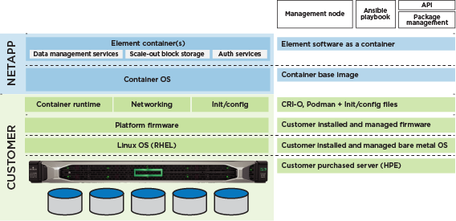
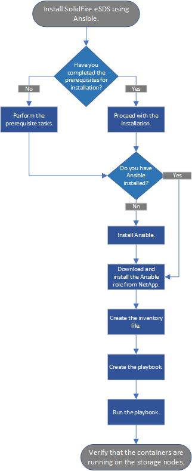

= 開始使用NetApp SolidFire 解決方案企業SDS
:allow-uri-read: 
:icons: font
:imagesdir: ../media/

[role="lead"]
NetApp SolidFire 支援企業級SDS（ESDS）可在SolidFire 符合參考組態的硬體上、在NetApp Element 您選擇的硬體上提供橫向擴充技術和支援的功能。SolidFire不受底層硬體影響、提供不受依賴的軟體。SolidFire NetApp Element這可讓您在符合NetApp參考組態的NetApp品牌應用裝置或一般用途伺服器上使用所有元素功能。

== 功能關鍵SolidFire

* 可讓您透過容器安裝及執行Element軟體。
* 使用預先驗證的市售伺服器平台、提供企業級儲存功能與可靠性。您可以在SolidFire 指定的x86伺服器平台和基礎元件（CPU、記憶體、SSD磁碟機、快取、網路、 韌體）、根據中已發佈的參考組態 https://mysupport.netapp.com/matrix/imt.jsp?components=97283;&solution=1757&isHWU&src=IMT["NetApp互通性對照表工具IMT （不含）"]。
* 提供閒置的軟體加密功能。「軟體加密閒置」功能可將寫入儲存叢集中SSD的所有資料加密。這可在SolidFire 不含自我加密磁碟機（SED）的不包含在內的各個ESDS節點中、提供主要的加密層。
* 使用服務品質（QoS）原則提供可預測的叢集效能。
* 支援四到40個節點的叢集。
* 已取得容量授權模式一詞的授權。
* 使用與技術合作夥伴簽訂的支援協議、以新模式提供支援。

有了NetApp的支援功能、您可以在符合必要需求的市售硬體上執行元件容器。SolidFire您自己帶著已安裝作業系統的伺服器。您可以使用Ansible等自動化工具來執行安裝前的法規遵循檢查、並安裝SolidFire ESXDS。在安裝前的設定工作中、您應該安裝管理節點、以支援記錄套件組合集合及SolidFire 其他服務、例如：「更新影像品質」。以下是SolidFire 架構總覽、顯示了整個EESDS環境中的各種元件：

NOTE: 您負責設定、監控及管理平台的生命週期、以及設定網路介面和路由表。

部分功能不適用於不完整的功能。NetApp Element SolidFire適用於傳統SolidFire 的靜態儲存節點的原生元素功能、例如硬體監控、韌體更新、使用自我加密磁碟機（SED）的加密靜止（Ear）、SolidFire 以及停用適用於ESSDS的光纖通道。

* 外部金鑰管理（EKM）
* 硬體加密
* 多磁碟機分片服務（MDSS）
* 硬體監控、主機平台更新（例如：驅動程式、韌體和作業系統套件）和Fibre Channel

== 快速入門資訊

您可以找到一套關於安裝SolidFire EESDS的精簡說明 link:../media/SDS_Quick_Start_Guide.pdf["請按這裡"^]。

== 授權原則

不適用NetApp條款容量授權模式。SolidFire

以下是此模型原則的高層級概觀：

* 軟體成本是以原始容量為基礎（磁碟機大小乘以節點或叢集內的磁碟機數量）、因此這種模式的軟體成本很容易預測。
* 您不需要軟體授權金鑰。您將會收到銷售訂單上軟體的主要序號、此序號隨附於您訂購後收到的文件套件中。您必須保留此主要序號、因為此序號將用於支援權益。

如需詳細資訊、請參閱 https://www.netapp.com/us/media/sb-4059.pdf["購買NetApp HCI 產品以供參考和SolidFire 使用"]。

== 用於安裝及使用SolidFire EESDS的介面

以下是您用於安裝、監控SolidFire 及管理VMware ESXDS的工具與介面清單：

[cols="3*"]
|===
| 工具/介面 | 使用者 | 說明 

 a| 
Ansible Compliance Check角色
 a| 
客戶
 a| 
以驗證平台是否符合中所列的參考組態 https://mysupport.netapp.com/matrix/imt.jsp?components=97283;&solution=1757&isHWU&src=IMT["NetApp互通性對照表工具（需登入）"^]。安裝SolidFire 完EESDS之前、您應該先執行此動作。

 a| 
Ansible安裝角色
 a| 
客戶
 a| 
用於安裝SolidFire 功能不彰的

 a| 
管理節點
 a| 
客戶
 a| 
適用於記錄套裝組合收集與管理服務、例如AIQ。

 a| 
NetApp混合雲控制
 a| 
客戶、NetApp支援
 a| 
用於叢集建立和每節點管理、以及從管理節點收集記錄。

 a| 
Hewlett Packard Enterprise（HPE）整合式熄燈（ILO）
 a| 
客戶、HPE支援
 a| 
用於收集有關事件和狀態的資料、以進行根本原因分析。

 a| 
Dell整合式Dell遠端存取控制器（iDRAC）
 a| 
客戶、Dell支援
 a| 
用於收集有關事件和狀態的資料、以進行根本原因分析。

 a| 
軟體UI NetApp Element
 a| 
客戶
 a| 
用於管理SolidFire 功能不彰的ESDS儲存叢集。

 a| 
Active IQ
 a| 
客戶、NetApp支援
 a| 
用於叢集健全狀況監控。

 a| 
一次收集
 a| 
NetApp支援
 a| 
以取得補充記錄。

|===

== 安裝總覽

您可以SolidFire 使用Ansible等自動化工具來安裝支援功能。

以下是使用Ansible進行安裝的高階概觀：

== 動態節點額定值（元素12.3.1的新功能！）

動態節點額定值是Element 12.3.1的新功能、可讓您在每個ESDS平台上運用24個支援的CPU、而非現今每個平台只需一個CPU的模式。

ESDS目前支援的所有平台均支援動態節點額定值：dL360、dL380和R640。

在第一版的動態節點額定值中、任何節點的IOPS最高額定值都是100K IOPS。

== 如需詳細資訊、請參閱

* https://www.netapp.com/data-storage/solidfire/documentation/["NetApp SolidFire 資源頁面"^]
* https://docs.netapp.com/sfe-122/topic/com.netapp.ndc.sfe-vers/GUID-B1944B0E-B335-4E0B-B9F1-E960BF32AE56.html["先前版本的NetApp SolidFire 產品及元素產品文件"^]

