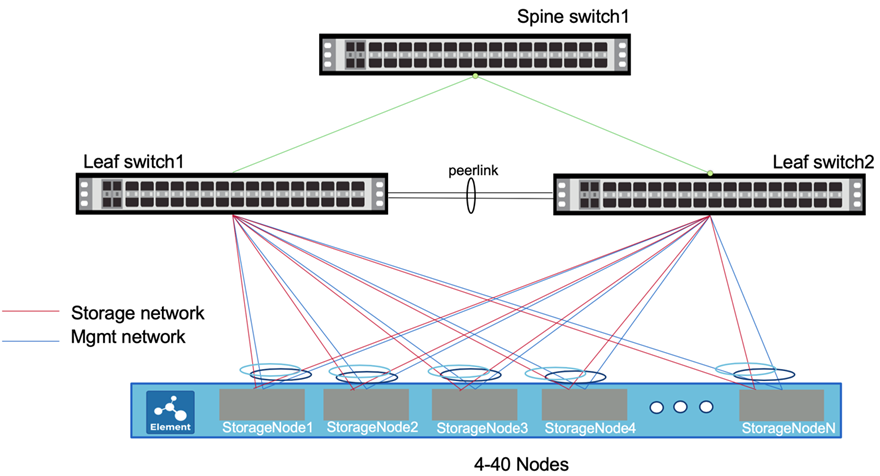

= 設定主機網路
:allow-uri-read: 
:icons: font
:imagesdir: ../media/

[role="lead"]
在安裝SolidFire 完整套功能之前、請先使用提供的範例和秘訣來設定主機網路。

以下是網路組態範例：

在此範例中、儲存節點上的兩個介面為網路 https://access.redhat.com/documentation/en-us/red_hat_enterprise_linux/7/html/networking_guide/ch-configure_network_teaming#sec-Understanding_Network_Teaming["已成組"^] 並連線至管理網路以進行備援。同樣地、還有兩個額外的介面會成組並連線至儲存網路。

NOTE: 每個介面都有一個名為ifcfg/-<interface-name>X的組態檔、其中X是介面的編號、根據使用的命名慣例、從零開始算起或從1開始算起。組態檔會在您第一次建立介面時建立。連線至儲存網路的兩個實體介面中、每個介面都應有一個組態檔。連線至管理網路的兩個實體介面中、每個介面也應該有一個組態檔。介面組態檔會放置在/etc/sysconfig/network-scripts目錄中。請參閱 https://access.redhat.com/documentation/en-us/red_hat_enterprise_linux/7/html/networking_guide/getting_started_with_networkmanager["介面組態檔"^]。

TIP: 此處提供的範例包含HPE伺服器的儲存與管理介面名稱。如果您有Dell伺服器、介面名稱會有所不同。Dell伺服器的儲存介面名稱為EM1和EM2。Dell伺服器的管理介面名稱為p3p1和p3p2。

.步驟
. 安裝「Network Manager -派遣台-路由規則」套件、並確定已設定適當的儲存庫。
. 使用交換器廠商的文件來設定網路交換器。如需有關設定多機箱連結集合群組（MLAG）傳輸協定和連結集合控制傳輸協定（LACP）的特定指示、請參閱交換器廠商的說明文件。
+

NOTE: 建議您設定LACP容錯移轉、並透過執行「無LACP暫停個別」來停用LACP個別連接埠暫停行為。如此一來、即使在設定錯誤的情況下、也能在不廣播LACP封包的情況下、存取點連結也能正常運作。

. 使用下列範例、編輯連線至儲存網路之實體介面的兩個組態檔。強烈建議在儲存網路上設定巨型框架、但不需要。在以下範例中、儲存介面名稱為ens2f0、儲存團隊名稱為team10G：
+

IMPORTANT: 在此處所列的所有範例組態中、名稱和裝置使用相同的值。如果您選擇使用不同的值、則可以使用不同的值。

+
[listing]
----
# cat /etc/sysconfig/network-scripts/ifcfg-ens2f0
# 10G Team Physical Port to Storage Network
NAME=ens2f0
DEVICE=ens2f0
ONBOOT=yes
TEAM_MASTER=team10G
DEVICETYPE=TeamPort
MTU=9000
----
. 使用下列範例編輯連線至管理網路之介面的兩個組態檔。在此範例中、管理介面名稱為eno5、管理團隊名稱為team1G：
+
[listing]
----
# cat ifcfg-eno5
# 1G Team Physical Port to Management Network
NAME=eno5
DEVICE=eno5
ONBOOT=yes
TEAM_MASTER=team1G
DEVICETYPE=TeamPort
----
. 使用下列範例為儲存團隊建立團隊介面檔案。在此範例中、團隊稱為team10G。它位於執行網路團隊LACP執行的儲存網路上。
+

NOTE: 建議將雙主動式組態用於儲存介面。此組態需要在交換器上設定額外的主動/主動式多機箱連結集合群組（MLAG）傳輸協定和連結集合控制傳輸協定（LACP）。此組態需要 https://access.redhat.com/documentation/en-us/red_hat_enterprise_linux/7/html/networking_guide/sec-Understanding_the_Network_Teaming_Daemon_and_the_Runners["網路團隊合作LACP跑者"^]。

+
[listing]
----
# cat /etc/sysconfig/network-scripts/ifcfg-team10G
# IPADDR= "SIP"
# GATEWAY= "SIP_GATEWAY"
# Pick one TEAM_CONFIG, activebackup or lacp
# note that lacp require changing switch port to lacp as well

TEAM_CONFIG="{\"runner\": {\"name\": \"lacp\"}, \"link_watch\": {\"name\": \"ethtool\"}}"
PROXY_METHOD=none
BROWSER_ONLY=no
BOOTPROTO=none
DEFROUTE=no
IPV4_FAILURE_FATAL=no
IPV6INIT=no
NAME=team10G
DEVICE=team10G
ONBOOT=yes
DEVICETYPE=Team
IPADDR=192.0.2.2
PREFIX=24
GATEWAY=192.0.2.1
NM_CONTROLLED=yes
MTU=9000
----
. 使用下列範例為管理團隊建立團隊介面檔案。在此範例中、團隊稱為team1G。它位於管理網路上、執行網路團隊活動備份執行者。
+

NOTE: 建議將主動/被動組態用於管理介面、不過您也可以使用主動/主動組態。這不需要在葉交換器上進行額外的組態設定。此組態使用 https://access.redhat.com/documentation/en-us/red_hat_enterprise_linux/7/html/networking_guide/sec-Understanding_the_Network_Teaming_Daemon_and_the_Runners["網路團隊合作執行備份執行者"]。

+
[listing]
----
# cat /etc/sysconfig/network-scripts/ifcfg-team1G
# IPADDR= "MIP"
# GATEWAY= "MIP_GATEWAY"
# DNS1= "DNS"
# Pick one TEAM_CONFIG, activebackup or lacp
# note that lacp require changing switch port to lacp as well

TEAM_CONFIG="{\"runner\": {\"name\": \"activebackup\"}, \"link_watch\": {\"name\": \"ethtool\"}}"
#TEAM_CONFIG=”{ \”runner\”: {\”name\”: \”lacp\”, \”active\”: true, \”fast_rate\”: true }}”
PROXY_METHOD=none
BROWSER_ONLY=no
BOOTPROTO=none
DEFROUTE=yes
IPV4_FAILURE_FATAL=no
IPV6INIT=no
IPV6_AUTOCONF=yes
IPV6_DEFROUTE=yes
IPV6_FAILURE_FATAL=no
IPV6_ADDR_GEN_MODE=stable-privacy
NAME=team1G
DEVICE=team1G
ONBOOT=yes
DEVICETYPE=Team
IPADDR=198.51.100.2
PREFIX=24
GATEWAY=198.51.100.1
DNS1=198.51.100.250
NM_CONTROLLED=yes
----
. 編輯「/etc/iproute2/rt_detces」檔案、以使用下列範例啟用新的路由表。此檔案會定義對應、以使用路由表名稱而非索引編號來參照特定表格。在下列範例中、名為team10G的新儲存路由表可依索引（20）或名稱（team10G）來呼叫：
+
[listing]
----
# cat /etc/iproute2/rt_tables
#
# reserved values
#
255local
254main
253default
0unspec

20   team10G
----
. 使用下列範例將儲存流量的路由新增至路由表。此路由表會將儲存網路作為預設閘道、必須用於iSCSI流量。在下列範例中、成組的介面名稱為team10G。
+

NOTE: 您應該更換「$storage網路」、「$storage if_name SRC」、「$sip表格」、「$rojeting_table名稱」、「$storage _default_wc開發」、 使用您自己的值提供「$storage、if_name SRC」、「$sip table」和「$roding_table名稱」。

+
[listing]
----
# cat /etc/sysconfig/network-scripts/route-team10G
$storage_network/24 dev $storage_if_name src $SIP table $routing_table_name
default via $storage_default_gw dev $storage_if_name src $SIP table \
$routing_table_name
----
. 新增原則型路由、以使用您建立的新路由表（如果流量來自於SIP或SVIP）。請使用下列範例、並以您自己的值取代：
+
[listing]
----
# cat /etc/sysconfig/network-scripts/rule-team10G
from $SIP table
$routing_table_name
----
. 重新啟動網路、以套用所有變更。
+
[listing]
----
# systemctl restart network.service
----
. 若要檢查原則型路由規則、請執行「ip rRule show」命令。
. 若要檢查路由表、請執行「ip route show table」命令。

== 如需詳細資訊、請參閱

* https://www.netapp.com/data-storage/solidfire/documentation/["NetApp SolidFire 資源頁面"^]
* https://docs.netapp.com/sfe-122/topic/com.netapp.ndc.sfe-vers/GUID-B1944B0E-B335-4E0B-B9F1-E960BF32AE56.html["先前版本的NetApp SolidFire 產品及元素產品文件"^]

