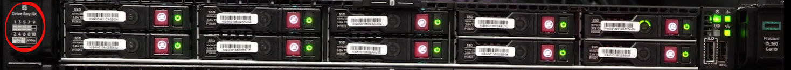
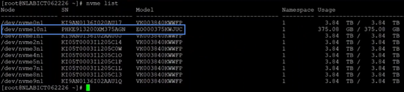
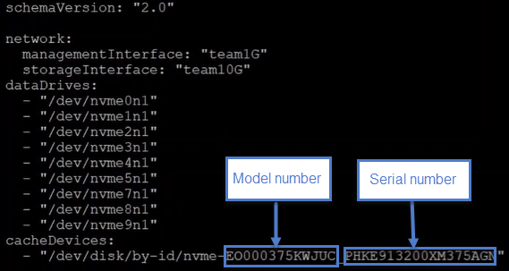

= 更換HPE 360
:allow-uri-read: 
:icons: font
:imagesdir: ../media/

[role="lead"]
從此處列出的程序中選擇主動更換磁碟機、在磁碟機故障後更換磁碟機、以及更換快取磁碟機。在SolidFire 您的SESDS叢集中更換中繼資料磁碟機或區塊磁碟機。Element UI *叢集>磁碟機*頁面會顯示磁碟機耗損資訊。

*  a drive proactively
*  a faulty drive
*  a cache drive

== 主動更換磁碟機

如果您想要主動更換SolidFire 您的EESDS叢集中的中繼資料磁碟機或區塊磁碟機、請執行此程序。Element UI *叢集*>*磁碟機*頁面會顯示磁碟機耗損資訊。

.您需要的是 #8217 ；需要的是什麼
* 從這個功能的UI中、確保叢集健全狀況良好、而且沒有任何警告或叢集故障。NetApp Element您可以使用主叢集節點的管理虛擬IP（MVIP）位址來存取元素UI。
* 確保叢集上沒有執行中的工作。
* 確保您已熟悉所有步驟。
* 處理磁碟機時、請務必採取必要的預防措施、以防止發生靜電釋放（ESD）。

.步驟
. 在Element UI中執行下列步驟：
+
.. 在Element UI中、選取*叢集*>*磁碟機*>* Active *。
.. 選取您要更換的磁碟機。
.. 記下磁碟機的序號。這將有助於您在節點的IPMI介面中找到對應的BayID（本例為HPE Integrated Light-Out或ILO）。
.. 選取*大量動作*>*移除*。移除磁碟機後、磁碟機將進入*移除*狀態。它會持續處於*移除*狀態一段時間、等待磁碟機上的資料同步或重新分配至叢集中的其餘磁碟機。移除完成後、磁碟機會移至*可用*狀態。

. 執行下列步驟、找出您要更換的磁碟機插槽：
+
.. 登入節點的IPMI介面（本例為ILO）。
.. 從左側導覽中選取*系統資訊*、然後選取*儲存*。
.. 請將您在上一步驟中記下的序號與您在畫面上看到的相符。
.. 請根據序號尋找所列的插槽編號。這是您必須從中移除磁碟機的實體插槽。

. 識別磁碟機之後、請依照下列步驟實際移除：
+
.. 識別磁碟機支架。
+
下圖顯示伺服器正面、磁碟機支架編號顯示在影像左側：

+

.. 按下您要更換的磁碟機上的電源按鈕。LED會持續閃爍5至10秒、然後停止。
.. LED停止閃爍且磁碟機關閉後、按下紅色按鈕並拉動栓鎖、即可將其從伺服器上移除。
+

NOTE: 請務必小心處理磁碟機。

+
實際移除磁碟機後、元素UI中的磁碟機狀態會變更為*故障*。

. 在Element UI中、選取*叢集*>*磁碟機*>*故障*。
. 選取「*動作*」下的圖示、然後選取「*移除*」。
+
現在您可以繼續在節點中安裝新磁碟機。

. 記下新磁碟機的序號。
. 使用栓鎖將磁碟機小心推入磁碟機槽、然後合上栓鎖、以插入更換的磁碟機。正確插入磁碟機時、磁碟機即會啟動。
. 請執行下列步驟、以驗證iLO:
+
.. 登入iLO.
.. 選擇*資訊*>*整合式管理記錄*。您會看到所新增磁碟機的事件記錄。
.. 從左側導覽中選取*系統資訊*、然後選取*儲存*。
.. 捲動直到找到您更換磁碟機的支架相關資訊。
.. 確認螢幕上的序號與您更換的新磁碟機序號相符。

. 將新的磁碟機資訊新增至您更換磁碟機的節點的「shf_SDS _config.yaml」檔案中。
+
「sf_SDs_config.yaml」檔案儲存在「/opt/sf/」中。此檔案包含節點中磁碟機的所有相關資訊。每次更換磁碟機時、您都必須在此檔案中輸入更換磁碟機的資訊。如需此檔案的詳細資訊、請參閱 link:reference_esds_sf_sds_config_file.html["SF_SDs_config.yaml檔案的內容"^]。

+
.. 使用Putty建立與節點的SSH連線。
.. 在Putty組態視窗的*主機名稱（或IP位址）*欄位中輸入節點MIP。
.. 選取*「Open*（開啟*）」。
.. 在開啟的終端機視窗中、使用您的使用者名稱和密碼登入。
.. 執行「# cat /opt/sf/sf_SDS _config.yaml」命令、列出檔案內容。
.. 將您更換的磁碟機的「data裝置」或「cacheDevice」清單中的項目取代為新的磁碟機資訊。
.. 執行「# systemctl start solidfire-update-drives」。
+
執行此命令後、您會看到Bash提示字元。之後您應該移至Element UI、將磁碟機新增至叢集。元素UI會針對可用的新磁碟機顯示警示。

. 選擇*叢集*>*磁碟機*>*可用*。
+
您會看到您安裝的新磁碟機序號。

. 選取「*動作*」下的圖示、然後選取「*新增*」。
. 區塊同步工作完成後、重新整理元素UI。如果您從元素UI的「*報告*」索引標籤存取「*執行中的工作*」頁面、就會看到有關可用磁碟機的警示已清除。

== 更換故障磁碟機

如果SolidFire 您的ESXESDS叢集有故障磁碟機、則Element UI會顯示警示。從叢集移除磁碟機之前、請先查看節點/伺服器IPMI介面中的資訊、以驗證故障原因。如果您要更換區塊磁碟機或中繼資料磁碟機、請執行下列步驟。

.您需要的是 #8217 ；需要的是什麼
* 從「支援軟體UI」中、確認磁碟機故障。NetApp Element元素會在磁碟機故障時顯示警示。您可以使用主叢集節點的管理虛擬IP（MVIP）位址來存取元素UI。
* 確保您已熟悉所有步驟。
* 處理磁碟機時、請務必採取必要的預防措施、以防止發生靜電釋放（ESD）。

.步驟
. 使用元素UI將故障磁碟機從叢集移除、如下所示：
+
.. 選擇*叢集*>*磁碟機*>*故障*。
.. 記下與故障磁碟機相關的節點名稱和序號。
.. 選取「*動作*」下的圖示、然後選取「*移除*」。如果您看到與磁碟機相關的服務警告、請等到Bin同步完成、然後取出磁碟機。

. 執行下列步驟以驗證磁碟機故障、並檢視與磁碟機故障相關的記錄事件：
+
.. 登入節點的IPMI介面（本例為ILO）。
.. 選擇*資訊*>*整合式管理記錄*。此處列出磁碟機故障的原因（例如SSDWearOut）和位置。您也可以看到一個事件、指出磁碟機的狀態已降級。
.. 從左側導覽中選取*系統資訊*、然後選取*儲存*。
.. 驗證故障磁碟機的可用資訊。故障磁碟機的狀態會顯示*降級*。

. 實際移除磁碟機、如下所示：
+
.. 識別機箱中的磁碟機插槽編號。
+
下圖顯示伺服器正面、磁碟機支架編號顯示在影像左側：

+

.. 按下您要更換的磁碟機上的電源按鈕。LED會持續閃爍5至10秒、然後停止。
.. LED停止閃爍且磁碟機關閉後、按下紅色按鈕並拉動栓鎖、即可將其從伺服器上移除。
+

NOTE: 請務必小心處理磁碟機。

. 使用栓鎖將磁碟機小心推入磁碟機槽、然後合上栓鎖、以插入更換的磁碟機。正確插入磁碟機時、磁碟機即會啟動。
. 驗證新磁碟機詳細資料、請參閱：
+
.. 選擇*資訊*>*整合式管理記錄*。您會看到所新增磁碟機的事件記錄。
.. 重新整理頁面、查看您新增磁碟機的記錄事件。

. 驗證您的儲存系統在ILO:
+
.. 從左側導覽中選取*系統資訊*、然後選取*儲存*。
.. 捲動直到找到安裝新磁碟機的支架相關資訊。
.. 記下序號。

. 將新的磁碟機資訊新增至您更換磁碟機的節點的「shf_SDS _config.yaml」檔案中。
+
「sf_SDs_config.yaml」檔案儲存在「/opt/sf/」中。此檔案包含節點中磁碟機的所有相關資訊。每次更換磁碟機時、您都必須在此檔案中輸入更換磁碟機的資訊。如需此檔案的詳細資訊、請參閱 link:reference_esds_sf_sds_config_file.html["SF_SDs_config.yaml檔案的內容"^]。

+
.. 使用Putty建立與節點的SSH連線。
.. 在Putty組態視窗的*主機名稱（或IP位址）*欄位中輸入節點MIP。
.. 選取*「Open*（開啟*）」。
.. 在開啟的終端機視窗中、使用您的使用者名稱和密碼登入。
.. 執行「# cat /opt/sf/sf_SDS _config.yaml」命令、列出檔案內容。
.. 將您更換的磁碟機的「data裝置」或「cacheDevice」清單中的項目取代為新的磁碟機資訊。
.. 執行「# systemctl start solidfire-update-drives」。
+
執行此命令後、您會看到Bash提示字元。之後您應該移至Element UI、將磁碟機新增至叢集。元素UI會針對可用的新磁碟機顯示警示。

. 選擇*叢集*>*磁碟機*>*可用*。
+
您會看到您安裝的新磁碟機序號。

. 選取「*動作*」下的圖示、然後選取「*新增*」。
. 區塊同步工作完成後、重新整理元素UI。如果您從元素UI的「*報告*」索引標籤存取「*執行中的工作*」頁面、就會看到有關可用磁碟機的警示已清除。

== 更換快取磁碟機

如果您想要更換SolidFire 您的EESDS叢集中的快取磁碟機、請執行此程序。快取磁碟機與中繼資料服務相關聯。Element UI *叢集*>*磁碟機*頁面會顯示磁碟機耗損資訊。

.您需要的是 #8217 ；需要的是什麼
* 從這個功能的UI中、確保叢集健全狀況良好、而且沒有任何警告或叢集故障。NetApp Element您可以使用主叢集節點的管理虛擬IP（MVIP）位址來存取元素UI。
* 確保叢集上沒有執行中的工作。
* 確保您已熟悉所有步驟。
* 請務必從Element UI移除中繼資料服務。
* 處理磁碟機時、請務必採取必要的預防措施、以防止發生靜電釋放（ESD）。

.步驟
. 在Element UI中執行下列步驟：
+
.. 在Element UI中、選取*叢集*>*節點*>*作用中*。
.. 記下您要更換快取磁碟機之節點的節點ID和管理IP位址。
.. 如果快取磁碟機狀況良好、而且您正主動更換快取磁碟機、請選取* Active Drives*、找出中繼資料磁碟機、然後從UI中移除。
+
移除後、中繼資料磁碟機會先進入*移除*狀態、然後進入*可用*。

.. 如果您在快取磁碟機故障後執行置換、中繼資料磁碟機將會處於*可用*狀態、並列在*叢集*>*磁碟機*>*可用*之下。
.. 在Element UI中、選取*叢集*>*磁碟機*>* Active *。
.. 選取與NodeName相關聯的中繼資料磁碟機、以取代快取磁碟機。
.. 選取*大量動作*>*移除*。移除磁碟機後、磁碟機將進入*移除*狀態。它會持續處於*移除*狀態一段時間、等待磁碟機上的資料同步或重新分配至叢集中的其餘磁碟機。移除完成後、磁碟機會移至*可用*狀態。

. 請執行下列步驟、找出您要更換的快取磁碟機插槽：
+
.. 登入節點的IPMI介面（本例為ILO）。
.. 從左側導覽中選取*系統資訊*、然後選取*儲存*。
.. 找到快取磁碟機。
+

NOTE: 快取磁碟機的容量低於儲存磁碟機。

.. 尋找所列的快取磁碟機插槽編號。這是您必須從中移除磁碟機的實體插槽。

. 識別磁碟機之後、請依照下列步驟實際移除：
+
.. 識別磁碟機支架。
+
下圖顯示伺服器正面、磁碟機支架編號顯示在影像左側：

+

.. 按下您要更換的磁碟機上的電源按鈕。LED會持續閃爍5至10秒、然後停止。
.. LED停止閃爍且磁碟機關閉後、按下紅色按鈕並拉動栓鎖、即可將其從伺服器上移除。
+

NOTE: 請務必小心處理磁碟機。

+
實際移除磁碟機後、元素UI中的磁碟機狀態會變更為*故障*。

. 記下HPE型號和新快取磁碟機的ISN（序號）。
. 使用栓鎖將磁碟機小心推入磁碟機槽、然後合上栓鎖、以插入更換的磁碟機。正確插入磁碟機時、磁碟機即會啟動。
. 請執行下列步驟、以驗證iLO:
+
.. 登入iLO.
.. 選擇*資訊*>*整合式管理記錄*。您會看到所新增磁碟機的事件記錄。
.. 從左側導覽中選取*系統資訊*、然後選取*儲存*。
.. 捲動直到找到您更換磁碟機的支架相關資訊。
.. 確認螢幕上的序號與您安裝的新磁碟機序號相符。

. 將新的快取磁碟機資訊新增到您更換磁碟機的節點的「sf_SDS _config.yaml」檔案中。
+
「sf_SDs_config.yaml」檔案儲存在「/opt/sf/」中。此檔案包含節點中磁碟機的所有相關資訊。每次更換磁碟機時、您都應該在此檔案中輸入更換磁碟機的資訊。如需此檔案的詳細資訊、請參閱 link:reference_esds_sf_sds_config_file.html["SF_SDs_config.yaml檔案的內容"^]。

+
.. 使用Putty建立與節點的SSH連線。
.. 在Putty組態視窗的*主機名稱（或IP位址）*欄位中、輸入節點MIP位址（您先前從元素UI記下的位址）。
.. 選取*「Open*（開啟*）」。
.. 在開啟的終端機視窗中、使用您的使用者名稱和密碼登入。
.. 執行「NVMe清單」命令以列出NVe裝置。
+
您可以看到新快取磁碟機的型號和序號。請參閱下列輸出範例：

+

.. 將新的快取磁碟機資訊新增至「/opt/sf/sf_SDS _config.yaml」。
+
您應該將現有的快取磁碟機型號和序號、替換成新快取磁碟機的對應資訊。請參閱下列範例：

+

.. 儲存「/opt/sf/sf_SDS _config.yaml」檔案。

. 針對您適用的案例執行步驟：
+
[cols="2*"]
|===
| 案例 | 步驟 

| 新插入的快取磁碟機會在您執行「NVMe清單」命令之後顯示  a| 
.. 運行‘# systemctl restart SolidFire ese'。這需要約三分鐘的時間。
.. 執行「System Status」（系統狀態）以檢查「SolidFire 示例」狀態SolidFire 。
.. 前往步驟9。

| 執行「NVMe清單」命令後、新插入的快取磁碟機不會出現  a| 
.. 重新啟動節點。
.. 節點重新開機後、SolidFire 請登入節點（使用Putty）並執行「系統狀態SolidFire show」命令、確認「支援」服務正在執行。
.. 前往步驟9。

|===
+

NOTE: 重新啟動SolidFire 「功能不全」或重新啟動節點、會導致一些叢集故障、但最終會在五分鐘內解決。

. 在元素UI中、將您移除的中繼資料磁碟機重新加入：
+
.. 選擇*叢集*>*磁碟機*>*可用*。
.. 選取「Actions（動作）」下的圖示、然後選取「* Add*（新增*）」。

. 區塊同步工作完成後、請重新整理元素UI。
+
您可以看到可用磁碟機的警示已清除、以及其他叢集故障。

== 如需詳細資訊、請參閱

* https://www.netapp.com/data-storage/solidfire/documentation/["NetApp SolidFire 資源頁面"^]
* https://docs.netapp.com/sfe-122/topic/com.netapp.ndc.sfe-vers/GUID-B1944B0E-B335-4E0B-B9F1-E960BF32AE56.html["先前版本的NetApp SolidFire 產品及元素產品文件"^]

