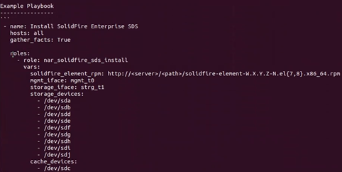

= 使用Ansible安裝SolidFire 功能
:allow-uri-read: 
:icons: font
:imagesdir: ../media/

[role="lead"]
您可以SolidFire 使用Ansible等自動化工具來安裝支援功能。如果您非常熟悉Ansible、可以建立一套可執行的教戰手冊、其中包含多項工作、例如安裝SolidFire Esesdss和建立叢集。

.您需要的產品
* 您已依照所提供的指示、在本機伺服器上安裝Ansible https://docs.ansible.com/ansible/latest/installation_guide/intro_installation.html#installation-guide["請按這裡"^]。
* 您已熟悉Ansible職務。請參閱 https://docs.ansible.com/ansible/latest/user_guide/playbooks_reuse_roles.html["請按這裡"^]。
* 您已執行所有列出的必要工作 link:concept_esds_prerequisite_tasks.html["請按這裡"^]。
* 您已經執行SolidFire 了一套關於EESDS的法規遵循檢查。如需如何執行法規遵循檢查的指示、請參閱 link:concept_esds_prerequisite_tasks.html["請按這裡"^]。

.關於這項工作
使用Ansible Vault取得敏感資訊、例如密碼、而非純文字。如需詳細資訊、請參閱下列連結：

* https://docs.ansible.com/ansible/latest/user_guide/playbooks_vault.html["使用Ansible Vault"^]
* https://docs.ansible.com/ansible/latest/user_guide/intro_inventory.html["如何建立庫存"^]

IMPORTANT: 您應該在庫存檔案中指定所有必要的變數、而非在實戰手冊中指定。

.步驟
. 執行「Ansible－galletical install」命令、安裝「na_solidfire_SDS安裝」角色。
+
[listing]
----
ansible-galaxy install git+https://github.com/NetApp-Automation/nar_solidfire_sds_install.git
----
+
您也可以從複製角色、手動安裝角色 https://github.com/NetApp-Automation["NetApp GitHub儲存庫"^] 並將角色放在「~/.Ansible /roses'」目錄中。NetApp提供README檔案、其中包含如何執行角色的相關資訊。

+

NOTE: 請務必下載最新版本的角色。

. 將您下載的角色往上移一個目錄、從其中安裝。
+
[listing]
----
 $ mv ~/.ansible/roles/ansible/nar_solidfire_sds_* ~/.ansible/roles/
----
. 執行「Ansible - gal銀河系 角色清單」命令、確保Ansible已設定為使用新的角色。
+
[listing]
----
 $ ansible-galaxy role list
 # ~/.ansible/roles
 - nar_solidfire_sds_install, (unknown version)
 - nar_solidfire_sds_upgrade, (unknown version)
 - ansible, (unknown version)
 - nar_solidfire_sds_compliance, (unknown version)
 - nar_solidfire_cluster_config, (unknown version)
 - nar_solidfire_sds_uninstall, (unknown version)
----
+

NOTE: 與角色相關的README檔案包含所有必要和選用變數的清單、您應該定義如下：

+

+
您應該在庫存檔案中定義這些變數、以便在下一步建立。

. 在Ansible工作目錄中建立庫存檔案。
+

TIP: 在庫存檔案中、您應該包含所有要安裝SolidFire 的主機（節點）。庫存檔案可讓教戰手冊（您將在下個步驟中建立）以單一命令管理多個主機。您也應該定義變數、例如儲存節點的使用者名稱和密碼、管理介面和儲存介面名稱等。

+
[IMPORTANT]
====
請務必遵循下列庫存檔案準則：*請針對裝置名稱使用正確的拼字。*在檔案中使用正確的格式化。*請確定只有一個快取裝置。*使用清單來指定儲存設備。

====
+

NOTE: 此處提供的範例包含HPE伺服器的儲存與管理介面名稱。如果您有Dell伺服器、快取裝置名稱為nvmey1n1。對於Dell伺服器、mgmt_iface為team1G、而storage _iface為team10G。

+
以下為庫存檔案範例。其中包含四個儲存節點。在此範例中、將*儲存節點Mip*取代為儲存節點的MIP位址、然後取代* 儲存節點的使用者名稱和密碼。

+
[listing]
----
all:
    hosts:
        storage node MIP:
        storage node MIP:
        storage node MIP:
        storage node MIP:
    vars:
        ansible_connection: ssh
        ansible_ssh_common_args: -o StrictHostKeyChecking=no
        ansible_user: *****
        ansible_ssh_pass: *****
        solidfire_element_rpm: http://sf-artifactory.solidfire.net/artifactory/crux/solidfire-element-**.*.*.***-*.***.x86_64.rpm
        mgmt_iface: "team0"
        storage_iface: "team1"
        storage_devices:
          - "/dev/nvme0n1"
          - "/dev/nvme1n1"
          - "/dev/nvme2n1"
          - "/dev/nvme3n1"
          - "/dev/nvme4n1"
          - "/dev/nvme5n1"
          - "/dev/nvme6n1"
          - "/dev/nvme7n1"
          - "/dev/nvme8n1"
        cache_devices:
          - "/dev/nvme9n1"
----
. Ping您在庫存檔案中定義的主機（節點）、以驗證Ansible是否能與其通訊。
. 將Red Hat套件管理程式（RPM）檔案下載至本機Web伺服器上的檔案目錄、可從執行Ansible和儲存節點的伺服器存取。
. 建立可執行的方針。如果您已經有一本教戰手冊、可以加以修改。您可以使用NetApp提供的README檔案中的範例。
. 執行您在上一個步驟中建立的教戰手冊來安裝SolidFire ESXDS：
+
[listing]
----
 $ ansible-playbook -i inventory.yaml sample_playbook.yaml
----
+
請將* Same_playbook .yaml*取代為您的教戰手冊名稱、並將* inventory.yaml*取代為您的庫存檔案名稱。執行本方針會在您的庫存檔案中列出的每個節點上建立「shf_SDS _config.yaml」檔案。它也會在SolidFire 每個儲存節點上安裝及啟動「樣化」服務。如需有關「shf_SDS _config.yaml」的詳細資訊、請參閱 link:reference_esds_sf_sds_config_file.html["請按這裡"^]。

. 檢查主控台的Ansible輸出、確保SolidFire 每個節點都已啟動該服務。
+
以下是輸出範例：

+
[listing]
----

TASK [nar_solidfire_sds_install : Ensure the SolidFire eSDS service is started] *********************************************************************************************

changed: [10.61.68.52]

changed: [10.61.68.54]

changed: [10.61.68.51]

changed: [10.61.68.53]

PLAY RECAP ******************************************************************************************************************************************************************

10.61.68.51                : ok=12   changed=3    unreachable=0
failed=0    skipped=10   rescued=0    ignored=0

10.61.68.52                : ok=12   changed=3    unreachable=0
failed=0    skipped=10   rescued=0    ignored=0

10.61.68.53                : ok=12   changed=3    unreachable=0
failed=0    skipped=10   rescued=0    ignored=0

10.61.68.54                : ok=12   changed=3    unreachable=0
failed=0    skipped=10   rescued=0    ignored=0
----
. 若要驗證SolidFire 是否正確啟動了這個功能、請執行「stystemctl STATUS SolidFire 」命令、然後檢查輸出中是否有「Active:active（outed）...」（作用中：作用中（結束）...）。

== 如需詳細資訊、請參閱

* https://www.netapp.com/data-storage/solidfire/documentation/["NetApp SolidFire 資源頁面"^]
* https://docs.netapp.com/sfe-122/topic/com.netapp.ndc.sfe-vers/GUID-B1944B0E-B335-4E0B-B9F1-E960BF32AE56.html["先前版本的NetApp SolidFire 產品及元素產品文件"^]

