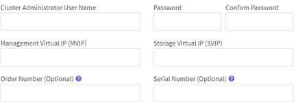

= 執行安裝後工作
:allow-uri-read: 
:icons: font
:imagesdir: ../media/

[role="lead"]
安裝SolidFire 完EESDS之後、請在每SolidFire 個EESDS節點上設定叢集名稱。然後您就可以建立SolidFire 一個EESDS叢集。

以下是安裝SolidFire 完整套功能後應完成的各項工作的深度概覽：

*  the cluster name
*  the license key
*  a cluster
*  drives to the cluster

NOTE: 您可以使用 link:https://github.com/NetApp-Automation/nar_solidfire_cluster_config["49284958c9d16c4b6d8ee9ddd4ebbca5"^] NetApp提供的可執行安裝後步驟的角色。如果您想要手動執行、請參閱下列步驟。

== 設定叢集名稱

您應該先在SolidFire 每個EESDS節點上設定叢集名稱、然後才能將節點新增至叢集。您可以使用每個節點的UI或元素API來執行此作業。

IMPORTANT: 您無法在建立叢集之後變更叢集名稱。

.步驟
. 從下列其中一個選項中選擇：
+
** 使用每節點UI：
+
... 開啟每個節點的管理節點UI：「https://<node_mip>:442`」。
... 選擇*叢集設定*並輸入叢集名稱。
... 選取*套用變更*。

** 使用 link:../api/reference_element_api_setclusterconfig.html["acf00854bc64655927abe2f08f53203f"^] API方法。
+
此方法具有下列輸入參數：

+
[cols="5*"]
|===
| 名稱 | 說明 | 類型 | 預設值 | 必要 

 a| 
《叢集》
 a| 
應在此方法呼叫期間變更的組態屬性。只有您想要變更的欄位才需要新增至此方法、做為此參數的成員。
 a| 
叢集
 a| 
無
 a| 
否

|===
+
請參閱下列申請範例：

+
[listing]
----
{
   "method": "SetClusterConfig",
   "params": {
      "cluster": {
         "name": "myhost",
         "mipi": "Bond10G"
      },
    "id" : 1
   }
}
----

== 設定授權金鑰

當您建立SolidFire 一個EESDS叢集時、需要授權金鑰資訊。NetApp支援部門也需要授權金鑰資訊、以協助解決問題。適用於EESDS叢集的授權金鑰SolidFire 包含叢集的訂單編號與序號、並會啟動您所購買的容量期限授權模式。

您可以使用「etLicenseKey」方法來設定SolidFire 適用於整個ESXDS儲存叢集的授權金鑰。「etLicenseKey」方法具有下列輸入參數：

[cols="5*"]
|===
| 名稱 | 說明 | 類型 | 預設值 | 必要 

 a| 
「orderNumber」
 a| 
此儲存叢集的新銷售訂單編號。
 a| 
字串
 a| 
無
 a| 
是的

 a| 
「週期號碼」
 a| 
此儲存叢集的新序號。
 a| 
字串
 a| 
無
 a| 
是的

|===
此方法具有下列傳回值：

[cols="3*"]
|===
| 名稱 | 說明 | 類型 

 a| 
「orderNumber」
 a| 
儲存叢集的新銷售訂單編號。
 a| 
字串

 a| 
「週期號碼」
 a| 
儲存叢集的新序號。
 a| 
字串

|===
.步驟
. 使用「etLicenseKey」API方法、如下列範例所示：
+
此方法的要求類似於下列範例：

+
[listing]
----
{
  "method": "SetLicenseKey",
  "params": {
    "orderNumber": "33601",
    "serialNumber": "30G56E3WV"   },
   "id" : 1
}
----
+
此方法會傳回類似下列範例的回應：

+
[listing]
----
{
   "id" : 1,
   "result" : {
      "serialNumber": "30G56E3WV",
      "orderNumber": "33601"
     }
   }
}
----

== 建立叢集

在每SolidFire 個ESXeesDS儲存節點上設定叢集名稱之後、您可以使用每節點UI或Element API來建立叢集。

IMPORTANT: 靜止時軟體加密預設為SolidFire 啟用、適用於不支援的ESDS叢集。如果您想要變更預設值、請在使用「Create Cluster」API方法建立叢集時執行此操作。

.步驟
. 從下列其中一個選項中選擇：
+
** 使用每節點UI：
+
... 開啟每個節點的管理節點UI：「https://<node_mip>:442*`」。
... 從左側導覽中選取*建立叢集*。
... 選取節點的核取方塊。將顯示「SFC100」的「ESXESDS」節點。SolidFire
... 輸入下列資訊：使用者名稱、密碼、管理虛擬IP（MVIP）位址、儲存虛擬IP（SVIP）位址、軟體訂單編號及序號。
+

NOTE: 建立叢集後、您無法變更MVIP和SVIP位址。不支援將相同的IP位址用於MVIP和SVIP。

+

NOTE: 您無法變更初始叢集管理員使用者名稱。

+

IMPORTANT: 如果您未指定訂單編號和序號、建立叢集作業將會失敗。

+

... 確認您已閱讀NetApp終端使用者授權合約。
... 選取*建立叢集*。
... 若要驗證是否已建立叢集、請登入叢集：「http://mvip_ip`」。
... 驗證叢集名稱、SVIP、MVIP、節點數和元素版本是否正確。

** 使用 link:../api/reference_element_api_createcluster.html["「建立叢集」"^] API方法。
+
此方法具有下列輸入參數：

+
[cols="5*"]
|===
| 名稱 | 說明 | 類型 | 預設值 | 必要 

 a| 
《接受書》
 a| 
建立此叢集時、請表示您接受終端使用者授權合約。若要接受EULA、請將此參數設為true。
 a| 
布林值
 a| 
無
 a| 
是的

 a| 
屬性
 a| 
Json物件格式的名稱-值配對清單。
 a| 
Json物件
 a| 
無
 a| 
否

 a| 
「enableSoftwareEncryptionAtRest」
 a| 
啟用此參數以在靜止時使用軟體加密。預設為true（在SolidFire 不實ESDS叢集上）。在所有其他叢集上預設為假。
 a| 
布林值
 a| 
是的
 a| 
否

 a| 
《VIP》
 a| 
管理網路上叢集的浮動（虛擬）IP位址。
 a| 
字串
 a| 
無
 a| 
是的

 a| 
節點
 a| 
組成叢集的初始節點集之CI/SIP位址。此節點的IP必須在清單中。
 a| 
字串陣列
 a| 
無
 a| 
是的

 a| 
「orderNumber」
 a| 
英數字元銷售訂單編號。在不必要的SolidFire 基礎上。
 a| 
字串
 a| 
無
 a| 
否（硬體型平台）是（軟體型平台）

 a| 
密碼
 a| 
叢集管理帳戶的初始密碼。
 a| 
字串
 a| 
無
 a| 
是的

 a| 
「週期號碼」
 a| 
九位數英數字元序號。在不必要的SolidFire 基礎上。
 a| 
字串
 a| 
無
 a| 
否（硬體型平台）是（軟體型平台）

 a| 
《VIP》
 a| 
儲存設備（iSCSI）網路上叢集的浮動（虛擬）IP位址。
 a| 
字串
 a| 
無
 a| 
是的

 a| 
《使用者名稱》
 a| 
叢集管理員的使用者名稱。
 a| 
字串
 a| 
無
 a| 
是的

|===
+
請參閱下列申請範例：

+
[listing]
----
{
  "method": "CreateCluster",
  "params": {
    "acceptEula": true,
    "mvip": "10.0.3.1",
    "svip": "10.0.4.1",
    "repCount": 2,
    "username": "Admin1",
    "password": "9R7ka4rEPa2uREtE",
    "attributes": {
      "clusteraccountnumber": "axdf323456"
    },
    "nodes": [
      "10.0.2.1",
      "10.0.2.2",
      "10.0.2.3",
      "10.0.2.4"
    ]
  },
  "id": 1
}
----

如需此方法的詳細資訊、請參閱 link:api/reference_element_api_createcluster.html["「建立叢集」"^]。

== 將磁碟機新增至叢集

您應該將磁碟機新增至SolidFire 您的EESDS叢集、以便它們能夠參與叢集。您可以使用元素UI或API來執行此作業。

.步驟
. 從下列其中一個選項中選擇：
+
** 使用元素UI：
+
... 從Element UI中、選取*叢集*>*磁碟機*。
... 選取*可用*以檢視可用磁碟機的清單。
... 若要新增個別磁碟機、請選取您要新增磁碟機的*「Actions」（動作）*圖示、然後選取*「Add*」（新增*）。
... 若要新增多個磁碟機、請選取要新增磁碟機的核取方塊、選取*大量動作*、然後選取*新增*。
... 確認已新增磁碟機、而且叢集容量符合預期。

** 使用 https://docs.netapp.com/us-en/element-software/docs/api/reference_element_api_adddrives.html["775ca0ad68fdedd2fe06eeb23598d120"^] API方法。
+
此方法具有下列輸入參數：

+
[cols="5*"]
|===
| 名稱 | 說明 | 類型 | 預設值 | 必要 

 a| 
《發展》
 a| 
每個要新增至叢集之磁碟機的相關資訊。可能值：

*** DriveID：要新增的磁碟機ID（整數）。
*** 類型：要新增的磁碟機類型（字串）。有效值為「slice」、「block」或「volume」。如果省略、系統會指派正確的類型。

 a| 
Json物件陣列
 a| 
無
 a| 
是（類型為選用）

|===
+
以下是申請範例：

+
[listing]
----
{
  "id": 1,
  "method": "AddDrives",
  "params": {
    "drives": [
      {
        "driveID": 1,
        "type": "slice"
      },
      {
        "driveID": 2,
        "type": "block"
      },
      {
        "driveID": 3,
        "type": "block"
      }
    ]
  }
}
----

如需此API方法的詳細資訊、請參閱 link:../api/reference_element_api_adddrives.html["775ca0ad68fdedd2fe06eeb23598d120"^]。

== 如需詳細資訊、請參閱

* https://www.netapp.com/data-storage/solidfire/documentation/["NetApp SolidFire 資源頁面"^]
* https://docs.netapp.com/sfe-122/topic/com.netapp.ndc.sfe-vers/GUID-B1944B0E-B335-4E0B-B9F1-E960BF32AE56.html["先前版本的NetApp SolidFire 產品及元素產品文件"^]

