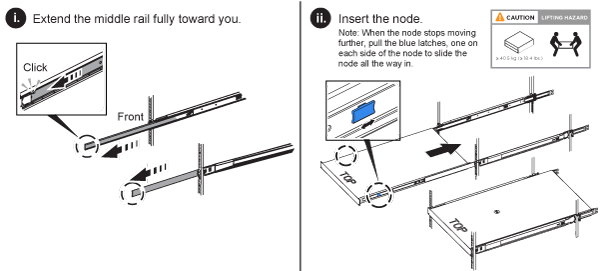

= 安裝H系列儲存節點
:allow-uri-read: 
:icons: font
:imagesdir: ../media/

[role="lead"]
開始使用All Flash儲存系統之前、您應該先正確安裝及設定儲存節點。

TIP: 請參閱 link:../media/hseries_isi.pdf["海報"^] 以視覺化方式呈現指示。

* <<工作流程圖>>
* <<準備安裝>>
* <<安裝滑軌>>
* <<安裝節點並連接纜線>>
* <<設定節點>>
* <<建立叢集>>

== 工作流程圖

此處的工作流程圖提供安裝步驟的高階概觀。視H系列機型而定、步驟可能稍有不同。

=== H410S

image::../media/h410s_isi_workflow.png[H410S安裝工作流程]

=== H610S

NOTE: 在H610S的情況下、「節點」和「機箱」兩個詞彙可互換使用、因為節點和機箱並不是獨立的元件、與2U四節點機箱不同。

image::../media/h610s_isi_workflow.png[H610S安裝工作流程]

== 準備安裝

在準備安裝時、請清點出貨給您的硬體、若有任何項目遺失、請聯絡NetApp支援部門。

請確定您的安裝位置有下列項目：

* 系統的機架空間。

[cols="2*"]
|===
| 節點類型 | 機架空間 

| H410S節點 | 兩個機架單元（2U） 

| H610S節點 | 一個機架單元（1U） 
|===
* SFP28/SFP+直接連接纜線或收發器
* Cat5e或更高規格纜線、含RJ45接頭
* 用於設定系統的鍵盤、視訊、滑鼠（KVM）交換器
* USB隨身碟（選用）

TIP: 出貨給您的硬體取決於您的訂單。全新的2U四節點訂單包括機箱、擋板、滑軌套件、磁碟機、儲存節點、 和電源線（每個機箱兩條）。如果您訂購H610S儲存節點、磁碟機就會安裝在機箱中。

CAUTION: 安裝硬體時、請務必將所有包裝材料和包裝從裝置中取出。如此可避免節點過熱和關機。

== 安裝滑軌

出貨給您的硬體訂單包含一組滑軌。您需要使用螺絲起子來完成軌道安裝。每個節點機型的安裝步驟略有不同。

TIP: 從機架底部到頂端安裝硬體、以避免設備翻覆。如果您的機架包含穩定裝置、請在安裝硬體之前先安裝。

* <<H410S>>
* <<H610S>>

=== H410S

H410S節點安裝在2U四節點H系列機箱中、隨附兩組介面卡。如果您想要將機箱安裝在有圓孔的機架中、請使用適合機架的轉接器來安裝圓孔。H410S節點的軌道可容納29英吋至33.5英吋深度的機架。當軌道完全外包時、長度為28英吋、且軌道的前後部份只能用一顆螺絲固定在一起。

CAUTION: 如果您將機箱安裝在完全外包的軌道上、則軌道的正面和背面部分可能會分開。

.步驟
. 將滑軌正面對齊機架正面柱上的孔。
. 將滑軌正面的掛勾推入機架正面柱上的孔中、然後向下推、直到裝有彈簧的掛栓卡入機架孔為止。
. 使用螺絲將滑軌連接至機架。以下是連接至機架正面的左滑軌圖例：
+
image::../media/h410s_rail.gif[2U的軌道安裝]

. 將滑軌的後部延伸至機架的後柱。
. 將滑軌背面的掛勾與後柱上的適當孔對齊、確保滑軌的正面和背面處於相同的高度。
. 將滑軌後端安裝到機架上、然後使用螺絲固定滑軌。
. 請針對機架的另一側執行上述所有步驟。

=== H610S

以下是安裝H610S儲存節點軌道的圖例：

image::../media/h610s_rail_isi.gif[H610S儲存節點的軌道安裝。]

TIP: H610S上有左右軌道。將螺絲孔朝向底部、以便H610S指旋螺絲可將機箱固定至軌道。

== 安裝節點並連接纜線

您可以在2U四節點機箱中安裝H410S儲存節點。對於H610S、請將機箱/節點直接安裝到機架的軌道上。

CAUTION: 從裝置中取出所有的包裝材料和包裝材料。如此可避免節點過熱和關機。

* <<H410S>>
* <<H610S>>

=== H410S

.步驟
. 在機箱中安裝H410S節點。以下是安裝了四個節點的機箱後視圖範例：
+
image::../media/sf_isi_chassis_rear.png[此圖顯示2U的背面]

+

WARNING: 抬起硬體並將其安裝到機架時請務必小心。空的兩個機架單元（2U）、四節點機箱重54.45磅（24.7公斤）、節點重8.0磅（3.6公斤）。

. 安裝磁碟機。
+
image::../media/hci_stor_node_ssd_bays.gif[此圖顯示2U的正面]

. 連接節點。
+

IMPORTANT: 如果機箱背面的通風孔被纜線或標籤阻塞、可能會因為過熱而導致元件提早故障。

+
image::../media/hci_isi_storage_cabling.png[本圖顯示H410S儲存節點的佈線。]

+
** 在連接埠A和B中連接兩條CAT5e或更高規格的纜線、以進行管理連線。
** 將兩條SFP28/SFP+纜線或收發器連接至連接埠C和D、以進行儲存連線。
** （選用、建議）在IPMI連接埠中連接CAT5e纜線、以進行頻外管理連線。

. 將電源線連接至每個機箱的兩個電源供應器、並將其插入240V PDU或電源插座。
. 開啟節點電源。
+

NOTE: 節點開機約需六分鐘。

+
image::../media/hci_poweron_isg.gif[此圖顯示2U節點上的電源按鈕]

=== H610S

.步驟
. 安裝H610S機箱。以下是在機架中安裝節點/機箱的圖例：
+

+

WARNING: 抬起硬體並將其安裝到機架時請務必小心。H610S機箱重40.5磅（18.4公斤）。

. 連接節點。
+

IMPORTANT: 如果機箱背面的通風孔被纜線或標籤阻塞、可能會因為過熱而導致元件提早故障。

+
image::../media/h600s_isi_noderear.png[此圖顯示H610S儲存節點的纜線佈線。]

+
** 使用兩條SFP28或SFP+纜線、將節點連接至10/25GbE網路。
** 使用兩個RJ45連接器將節點連接至1GbE網路。
** 使用IPMI連接埠中的RJ-45連接器、將節點連接至1GbE網路。
** 將兩條電源線連接至節點。

. 開啟節點電源。
+

NOTE: 節點開機大約需要五分鐘30秒。

+
image::../media/h600s_isi_nodefront.png[此圖顯示H610S機箱正面、並強調顯示電源按鈕。]

== 設定節點

在您安裝機架並連接硬體之後、就可以開始設定新的儲存資源了。

.步驟
. 將鍵盤和顯示器連接至節點。
. 在顯示的終端使用者介面（TUI）中、使用螢幕導覽來設定節點的網路和叢集設定。
+

NOTE: 您應該從TUI取得節點的IP位址。當您將節點新增至叢集時、就需要此功能。儲存設定之後、節點會處於擱置狀態、並可新增至叢集。請參閱<插入設定連結>一節。

. 使用基礎板管理控制器（BMC）設定頻外管理。這些步驟僅適用於* H610S*節點。
+
.. 使用網頁瀏覽器瀏覽至預設BMC IP位址：192．168．0．120
.. 使用* root*作為使用者名稱登入、* calin*作為密碼登入。
.. 在節點管理畫面中、瀏覽至*設定*>*網路設定*、然後設定頻外管理連接埠的網路參數。

TIP: 請參閱 https://kb.netapp.com/Advice_and_Troubleshooting/Hybrid_Cloud_Infrastructure/NetApp_HCI/How_to_access_BMC_and_change_IP_address_on_H610S["此知識庫文章（需要登入）"]。

== 建立叢集

將儲存節點新增至安裝並設定新的儲存資源之後、即可建立新的儲存叢集

.步驟
. 從與新設定節點位於相同網路上的用戶端NetApp Element 、輸入節點的IP位址即可存取整套軟體UI。
. 在「建立新叢集」視窗中輸入必要資訊。請參閱 link:../setup/concept_setup_overview.html["設定總覽"^] 以取得更多資訊。

== 如需詳細資訊、請參閱

* https://www.netapp.com/data-storage/solidfire/documentation/["NetApp SolidFire 資源頁面"^]
* https://docs.netapp.com/sfe-122/topic/com.netapp.ndc.sfe-vers/GUID-B1944B0E-B335-4E0B-B9F1-E960BF32AE56.html["先前版本的NetApp SolidFire 產品及元素產品文件"^]

