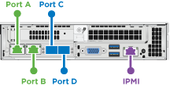
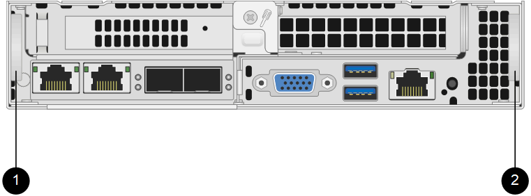

= 更換H410S節點
:allow-uri-read: 
:icons: font
:imagesdir: ../media/

[role="lead"]
如果CPU故障、Radan卡問題、其他主機板問題、或是無法開機、您應該更換儲存節點。這些說明適用於H410S儲存節點。

當儲存節點發生故障時、會發出「無法使用的軟體UI警示」NetApp Element 警示。您應該使用Element UI取得故障節點的序號（服務標籤）。您需要此資訊、才能在叢集中找到故障節點。

以下是兩個機架單元（2U）、四節點機箱的背面、有四個儲存節點：

image::hci_stornode_rear.gif[此圖顯示四節點機箱、含四個儲存節點。]

以下是具有H410S節點的四節點機箱正面視圖、顯示對應於每個節點的磁碟槽：

image::hci_stor_node_ssd_bays.gif[顯示與H410S節點的四節點機箱中每個節點相關聯的磁碟槽。]

.您需要的產品
* 您已確認儲存節點故障、需要更換。
* 您已取得替換儲存節點。
* 您有一個防靜電（ESD）腕帶、或是您已採取其他防靜電保護措施。
* 您已標記每條連接至儲存節點的纜線。

以下是這些步驟的高階概觀：

* <<準備更換節點>>
* <<更換機箱中的節點>>
* <<將節點新增至叢集>>

== 準備更換節點

在安裝替換節點之前、您應該在NetApp Element 叢集中正確移除故障的儲存節點。您可以在不造成任何服務中斷的情況下執行此操作。您應該從Element UI取得故障儲存節點的序號、並將其與節點背面貼紙上的序號配對。

.步驟
. 在Element UI中、選取*叢集*>*磁碟機*。
. 使用下列其中一種方法、從節點移除磁碟機：
+
[cols="2*"]
|===
| 選項 | 步驟 

 a| 
移除個別磁碟機
 a| 
.. 針對您要移除的磁碟機、按一下*「Actions」（動作）*。
.. 按一下「*移除*」。

 a| 
移除多個磁碟機
 a| 
.. 選取您要移除的所有磁碟機、然後按一下*大量動作*。
.. 按一下「*移除*」。

|===
. 選擇*叢集*>*節點*。
. 記下故障節點的序號（服務標籤）。您應該將其與節點背面貼紙上的序號配對。
. 記下序號之後、請依照下列步驟從叢集移除節點：
+
.. 選取您要移除之節點的*「Actions」（動作）*按鈕。
.. 選擇*移除*。

== 更換機箱中的節點

使用NetApp Element 完故障節點之後、您可以使用支援功能的UI從叢集移除故障節點、以便從機箱中實際移除節點。您應該將替換節點安裝在機箱的同一個插槽中、以便從其中移除故障節點。

.步驟
. 繼續之前、請先戴上防靜電保護裝置。
. 打開新儲存節點的包裝、並將其放在靠近機箱的水平面上。
+
將故障節點退回NetApp時、請保留包裝材料。

. 標示要移除之儲存節點背面的每條纜線。
+
安裝新的儲存節點之後、您應該將纜線插入原始連接埠。

+
以下是顯示儲存節點背面的影像：

+

+
[cols="2*"]
|===
| 連接埠 | 詳細資料 

 a| 
連接埠A
 a| 
1/10GbE RJ45連接埠

 a| 
連接埠B
 a| 
1/10GbE RJ45連接埠

 a| 
連接埠C
 a| 
10/25GbE SFP+或SFP28連接埠

 a| 
連接埠D
 a| 
10/25GbE SFP+或SFP28連接埠

 a| 
IPMI
 a| 
1/10GbE RJ45連接埠

|===
. 從儲存節點拔下所有纜線。
. 向下拉節點右側的CAM握把、然後使用兩個CAM握把將節點拉出。
+
您下拉的CAM握把上有一個箭頭、指示其移動方向。另一個CAM握把無法移動、可協助您將節點拉出。

+

+
[cols="2*"]
|===
| 項目 | 說明 

 a| 
1.
 a| 
CAM握把可協助您將節點拉出。

 a| 
2.
 a| 
將節點拉出之前、請先將其往下拉的CAM握把。

|===
+

NOTE: 將節點從機箱中拉出時、請用手支撐節點。

. 將節點放置在水平表面上。
+
您必須將節點封裝回NetApp。

. 將替換節點安裝在機箱的同一個插槽中。
+

IMPORTANT: 將節點滑入機箱時、請確保不會過度施力。

. 將磁碟機從您移除的節點移出、然後插入新節點。
. 將纜線重新連接至原本拔下纜線的連接埠。
+
拔下纜線時、纜線上的標籤有助於引導您。

+
[NOTE]
====
.. 如果機箱背面的通風孔被纜線或標籤阻塞、可能會因為過熱而導致元件提早故障。
.. 請勿將纜線強制插入連接埠、否則可能會損壞纜線、連接埠或兩者。

====
+

TIP: 請確定替換節點的纜線方式與機箱中的其他節點相同。

. 按下節點正面的按鈕以開啟電源。

== 將節點新增至叢集

當您將節點新增至叢集或在現有節點中安裝新磁碟機時、磁碟機會自動登錄為可用。您必須先使用元素UI或API將磁碟機新增至叢集、才能參與叢集。

叢集中每個節點上的軟體版本均應相容。將節點新增至叢集時、叢集會視需要在新節點上安裝Element軟體的叢集版本。

.步驟
. 選擇*叢集*>*節點*。
. 選取*「Pending」（擱置）*以檢視擱置節點的清單。
. 執行下列其中一項：
+
** 若要新增個別節點、請針對您要新增的節點選取*「Actions」（動作）*圖示。
** 若要新增多個節點、請選取要新增之節點的核取方塊、然後選取*大量動作*。
+

NOTE: 如果您要新增的節點與叢集上執行的版本不同、叢集會非同步地將節點更新為叢集主機上執行的Element軟體版本。節點更新後、會自動將自己新增至叢集。在此非同步程序期間、節點將處於「pendingActive」狀態。

. 選取*「Add*」。
+
節點會出現在作用中節點清單中。

. 從Element UI中、選取*叢集*>*磁碟機*。
. 選取*可用*以檢視可用磁碟機的清單。
. 執行下列其中一項：
+
** 若要新增個別磁碟機、請選取您要新增磁碟機的*「Actions」（動作）*圖示、然後選取*「Add*」（新增*）。
** 若要新增多個磁碟機、請選取要新增磁碟機的核取方塊、選取*大量動作*、然後選取*新增*。

== 如需詳細資訊、請參閱

* https://docs.netapp.com/us-en/element-software/index.html["零件與元件軟體文件SolidFire"]
* https://docs.netapp.com/sfe-122/topic/com.netapp.ndc.sfe-vers/GUID-B1944B0E-B335-4E0B-B9F1-E960BF32AE56.html["先前版本的NetApp SolidFire 產品及元素產品文件"^]

