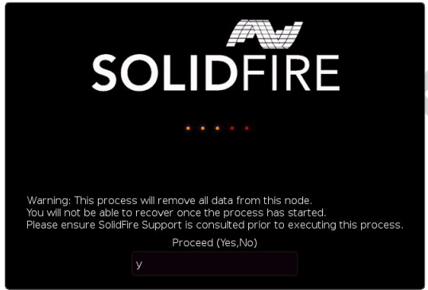

= RTFI程序
:allow-uri-read: 
:icons: font
:imagesdir: ../media/

[role="lead"]
您可以透過系統開機前出現的文字主控台提示、與節點互動、開始返回原廠映像（RTFI）程序。

WARNING: RTFI程序具有資料破壞性、可安全地清除節點的所有資料和組態詳細資料、並安裝新的作業系統。驗證用於RTFI程序的節點是否未作為叢集的一部分作用。

RTFI程序會執行下列高層級作業：

. 在使用者確認並驗證映像之後開始安裝。
. 解除鎖定節點上的所有磁碟機。
. 驗證並更新韌體。
. 檢查硬體。
. 測試硬體。
. 安全清除所有選取的磁碟機。
. 分割根磁碟機並建立檔案系統。
. 掛載及解壓縮映像。
. 設定主機名稱、網路連線（動態主機組態傳輸協定）、預設叢集組態和Grub開機載入器。
. 停止所有服務、收集記錄並重新開機。

若要在RTFI程序成功完成後設定節點、請參閱 https://docs.netapp.com/us-en/element-software/index.html["Element軟體版本的文件"^]。節點成功完成RTFI程序之後、預設會轉換成_可用（未設定）狀態。

== 執行RTFI程序

請使用下列程序還原SolidFire 您的節點上的Element軟體。

如需建立USB金鑰或使用BMC執行RTFI程序的相關資訊、請參閱 xref:task_rtfi_deployment_and_install_options.adoc[RTFI部署與安裝選項]。

.開始之前
確認您符合下列要求：

* 您可以存取SolidFire 適用於此節點的主控台。
* 您執行RTFI程序的節點會開啟電源並連線至網路。
* 您執行RTFI程序的節點並非作用中叢集的一部分。
* 您可以存取可開機安裝媒體、其中包含組態的相關元件軟體版本映像。

如果您在執行RTFI程序之前有任何疑慮、請聯絡NetApp支援部門。

.步驟
. 將監視器和鍵盤連接至節點背面、或連線至BMC IP UI、然後從UI的*遠端控制*索引標籤啟動* KIKM/HTML5*主控台。
. 將具有適當映像的USB隨身碟插入節點背面兩個USB插槽中的其中一個。
. 開啟電源或重新啟動節點。在開機期間、選取* F11 *以選取「Boot Device（開機裝置）」：
+

NOTE: 您必須快速連續選擇* F11 *多次、因為開機裝置畫面會快速移動。

. 在Boot Device（引導設備）選擇菜單中，高亮顯示USB選項。
+
顯示的選項取決於您使用的USB品牌。

+
[NOTE]
====
如果未列出USB裝置、請進入BIOS、確認USB列在開機順序中、重新開機、然後再試一次。

如果仍無法解決問題、請進入BIOS、瀏覽至*儲存並結束*索引標籤、選擇*還原為最佳化的預設值*、接受並儲存設定、然後重新開機。

====
. 此時會出現反白顯示的USB裝置上的影像清單。選取所需的版本、然後選取Enter以啟動RTFI程序。
+
畫面上會顯示RTFI映像元素軟體名稱和版本編號。

. 在初始提示時、系統會通知您該程序將會從節點移除所有資料、而且資料在程序開始後無法恢復。輸入* Yes*開始。
+

WARNING: 所有資料和組態詳細資料都會在程序啟動後從節點永久清除。如果您選擇不繼續、系統會將您導向至 xref:task_rtfi_options_menu.html[RTFI選項功能表]。

+

NOTE: 如果您想在RTFI程序期間觀看主控台、可以按下* ALT+F8*鍵切換至詳細模式主控台。按* ALT+F1*返回主GUI。

. 除非您有理由懷疑硬體故障、或是被NetApp支援部門指示執行測試、否則當系統提示您執行大量硬體測試時、請輸入* No*。
+
訊息表示RTFI程序已完成、系統已關機。

. 必要時、請在節點關機後移除所有可開機的安裝媒體。
+
節點現在已準備好要開機並進行設定。請參閱 https://docs.netapp.com/us-en/element-software/setup/concept_setup_overview.html["Element軟體設定儲存文件"^] 以設定儲存節點。

+
如果您在RTFI程序期間遇到錯誤訊息、請參閱 xref:task_rtfi_options_menu.html[RTFI選項功能表]。

== 如需詳細資訊、請參閱

* https://docs.netapp.com/us-en/element-software/index.html["零件與元件軟體文件SolidFire"]
* https://docs.netapp.com/sfe-122/topic/com.netapp.ndc.sfe-vers/GUID-B1944B0E-B335-4E0B-B9F1-E960BF32AE56.html["先前版本的NetApp SolidFire 產品及元素產品文件"^]

