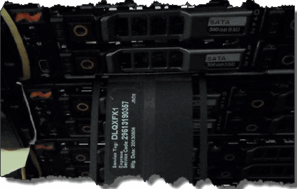

= 更換機箱
:allow-uri-read: 
:icons: font
:imagesdir: ../media/

[role="lead"]
如果風扇、中央處理器（CPU）或雙列直插式記憶體模組（DIMM）故障、您可能需要更換機箱、或是修正開機程序的過熱問題或問題。透過使用者介面（UI）的叢集故障NetApp Element 、以及機箱正面的黃色指示燈持續亮起、代表可能需要更換機箱。在繼續之前、請先聯絡NetApp支援部門。

.您需要的是 #8217 ；需要的是什麼
* 您已聯絡NetApp支援部門。
+
如果您要訂購替換產品、則必須透過NetApp支援部門開啟案例。

* 您已取得替換機箱。
* 您有一個防靜電（ESD）腕帶、或是您已採取其他防靜電保護措施。
* 如果您需要執行恢復原廠映像（RTFI）程序、表示您已取得USB金鑰。
+
NetApp支援將協助您決定是否需要RTFI。請參閱 https://kb.netapp.com/Advice_and_Troubleshooting/Hybrid_Cloud_Infrastructure/NetApp_HCI/How_to_create_an_RTFI_key_to_re-image_a_SolidFire_storage_node["此知識庫文章（需要登入）"]。

* 您有鍵盤和顯示器。

如果您的機架單元（1U）機箱具有下列任一節點、則適用本文件中的指示：

* SF2405
* SF3010
* SF4805
* SF6010
* SF9605
* SF9608
* SF9010
* SF19210
* SF38410
* SF-FCN-01
* FC0025

.步驟
. 找出故障機箱的服務標籤、並確認序號與您訂購替換產品時透過NetApp Support開啟的機箱編號相符。
+
您可以從機箱正面找到服務標籤。

+
下圖為服務標籤範例：

+

+

NOTE: 上圖為範例。服務標籤的確切位置可能會因硬體機型而異。

. 將鍵盤和顯示器插入故障機箱的背面。
. 請透過NetApp支援來驗證機箱資訊。
. 關閉機箱電源。
. 標示機箱正面的磁碟機、以及背面的纜線。
+

NOTE: Fibre Channel節點正面沒有磁碟機。

. 拔下電源供應器和纜線。
. 小心地取出磁碟機、並將其放在防靜電的水平表面上。
+

NOTE: 如果您有光纖通道節點、可以跳過此步驟。

. 根據硬體機型、按下栓鎖或旋開指旋螺絲、以卸下機箱。
+
您應該將故障機箱封裝並退回給NetApp。

. *選用*：移除軌道、然後安裝替換機箱隨附的新軌道。
+
您可以選擇重複使用現有的軌道。如果您要重複使用現有的軌道、可以跳過此步驟。

. 將替換機箱滑入滑軌。
. 對於儲存節點、請將故障機箱中的磁碟機插入更換機箱。
+

NOTE: 您應該將磁碟機插入與故障機箱相同的插槽中。

. 安裝電源供應器。
. 將電源供應器纜線、以及1GbE和10GbE纜線插入其原始連接埠。
+
小型可插拔（SFP）收發器可能會插入替換機箱的10GbE連接埠。在連接10GbE連接埠之前、您應該先將其移除。

. 如果您確定不需要在節點上執行RTFI程序、請啟動節點、然後等到終端使用者介面（TUI）出現。繼續執行步驟16、並允許叢集在您使用UI新增節點時、自動重新建立節點映像。
. *選用*：如果NetApp支援部門建議使用USB金鑰重新建立節點映像、請執行下列子步驟：
+
.. 開啟機箱電源。它會以RTFI主要映像開機。
.. 在第一個提示字元中、輸入* Y*來映像儲存節點。
.. 在第二個提示字元中、輸入* N*進行硬體健全狀況檢查。
+
如果RTFI指令碼偵測到硬體元件有問題、就會在主控台顯示錯誤。如果您發現錯誤、請聯絡NetApp支援部門。RTFI程序完成後、節點便會關機。

.. 從USB插槽中取出USB隨身碟。
.. 開機新映像的節點、然後等待TUI出現。

. 從TUI設定網路和叢集資訊。
+
您可以聯絡NetApp支援部門以取得協助。

. 使用叢集TUI將新節點新增至叢集。
. 裝回故障的機箱。

== 如需詳細資訊、請參閱

* https://www.netapp.com/data-storage/solidfire/documentation/["NetApp SolidFire 資源頁面"^]
* https://docs.netapp.com/sfe-122/topic/com.netapp.ndc.sfe-vers/GUID-B1944B0E-B335-4E0B-B9F1-E960BF32AE56.html["先前版本的NetApp SolidFire 產品及元素產品文件"^]

