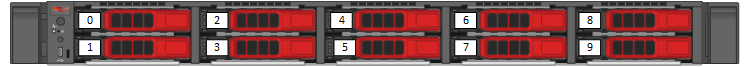
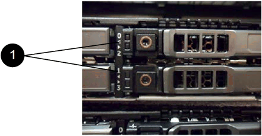

= 更換SF系列儲存節點的磁碟機
:allow-uri-read: 
:icons: font
:imagesdir: ../media/

[role="lead"]
您可以將故障的固態磁碟機與更換的磁碟機熱交換。

.您需要的是 #8217 ；需要的是什麼
* 您有替換磁碟機。
* 您有一個防靜電（ESD）腕帶、或是您已採取其他防靜電預防措施。
* 您已聯絡NetApp支援部門、確認需要更換SSD、並協助您執行適當的解決程序。
+
致電NetApp支援中心時、您將需要服務標籤或序號。支援部門將與您合作、根據您的服務層級協議來取得更換磁碟機。

這些說明適用於下列SolidFire 的各種不同儲存節點機型：

* SF2405
* SF3010
* SF4805
* SF6010
* SF9605
* SF9608
* SF9010
* SF19210
* SF38410

下圖顯示磁碟機在SF9605機箱中的位置：

NOTE: 上圖為範例。SF9608具有不同的磁碟機配置、其中僅包含從左到右編號為一到八的八個磁碟機。

插槽0容納節點的中繼資料磁碟機。如果您要更換插槽0中的磁碟機、則必須在更換磁碟機的包裝箱上貼上隨附的貼紙、以便與其他磁碟機分開識別。SF3010是一項例外、因為中繼資料會保留在內部序列進階技術附件（SATA）雙列直插式記憶體模組（DIMM）上。

[NOTE]
====
在處理磁碟機時、請遵循下列最佳實務做法：

* 請將磁碟機放在防靜電袋中、直到您準備好安裝為止、以防止靜電釋放（ESD）。
* 請勿將金屬工具或刀插入電子設備保護袋。
* 用手打開電子安全袋、或用一把剪器剪下頂端。
* 請保留防靜電保護袋及任何包裝材料、以防日後必須歸還磁碟機。
* 請務必戴上接地於機箱上未上漆表面的ESD腕帶。
* 拆下、安裝或攜帶磁碟機時、請務必使用雙手。
* 切勿將磁碟機強制裝入機箱。
* 切勿將磁碟機堆疊在彼此之上。
* 在運送磁碟機時、請務必使用核准的包裝。

====
以下是這些步驟的高階概觀：

* <<Remove the drive from the cluster>>
* <<Replace the drive from the chassis>>
* <<Add the drive to the cluster>>

== 從叢集移除磁碟機

如果磁碟機的自我診斷顯示節點故障、或是與磁碟機的通訊停止五分鐘半或更長時間、則該系統會將磁碟機置於故障狀態。SolidFire系統會顯示故障磁碟機的清單。您應該從NetApp Element 故障磁碟機清單中移除故障磁碟機、以供使用。

.步驟
. 在Element UI中、選取*叢集*>*磁碟機*。
. 選取*故障*以檢視故障磁碟機清單。
. 記下故障磁碟機的插槽編號。
+
您需要這些資訊、才能在機箱中找到故障磁碟機。

. 使用下列其中一種方法移除故障磁碟機：
+
[cols="2*"]
|===
| 選項 | 步驟 

 a| 
移除個別磁碟機
 a| 
.. 針對您要移除的磁碟機選取*「Actions」（動作）*。
.. 選擇*移除*。

 a| 
移除多個磁碟機
 a| 
.. 選取您要移除的所有磁碟機、然後選取*大量動作*。
.. 選擇*移除*。

|===

== 從機箱中裝回磁碟機

從元素UI的故障磁碟機清單中移除故障磁碟機之後、您就可以從機箱實際更換故障磁碟機。

.步驟
. 打開備用磁碟機的包裝、然後將其放在機架附近的無靜電平面上。
+
將故障磁碟機退回NetApp時、請儲存包裝材料。

. 將故障磁碟機的插槽編號從Element UI與機箱上的編號配對。
+
下圖為顯示磁碟機插槽編號的範例：

+

+
[cols="2*"]
|===
| 項目 | 說明 

 a| 
1.
 a| 
磁碟機插槽編號

|===
. 按下您要移除磁碟機上的紅色圓圈、以釋放磁碟機。
+
鎖扣卡住即會開啟。

. 將磁碟機滑出機箱、然後放在無靜電且水平的表面上。
. 將替換磁碟機滑入插槽之前、請先按下該磁碟機上的紅色圓圈。
. 插入替換磁碟機、然後按下紅色圓圈以關閉栓鎖。
. 通知NetApp支援部門更換磁碟機的相關資訊。
+
NetApp支援部門將提供退回故障磁碟機的指示。

== 將磁碟機新增至叢集

在機箱中安裝新磁碟機之後、它會登錄為「可用」。您應該先使用元素UI將磁碟機新增至叢集、然後才能加入叢集。

.步驟
. 在Element UI中、按一下*叢集*>*磁碟機*。
. 按一下*「可用」*以檢視可用磁碟機的清單。
. 請選擇下列其中一個選項來新增磁碟機：
+
[cols="2*"]
|===
| 選項 | 步驟 

 a| 
以新增個別磁碟機
 a| 
.. 選取您要新增磁碟機的*「Actions」（動作）*按鈕。
.. 選取*「Add*」。

 a| 
以新增多個磁碟機
 a| 
.. 選取要新增磁碟機的核取方塊、然後選取*大量動作*。
.. 選取*「Add*」。

|===

== 如需詳細資訊、請參閱

* https://www.netapp.com/data-storage/solidfire/documentation/["NetApp SolidFire 資源頁面"^]
* https://docs.netapp.com/sfe-122/topic/com.netapp.ndc.sfe-vers/GUID-B1944B0E-B335-4E0B-B9F1-E960BF32AE56.html["先前版本的NetApp SolidFire 產品及元素產品文件"^]

