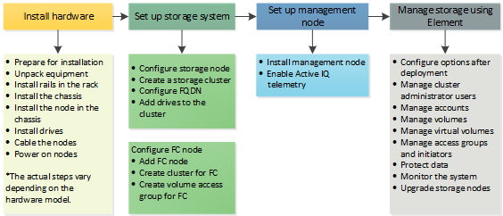

= 設定總覽
:allow-uri-read: 
:icons: font
:imagesdir: ../media/

[role="lead"]
此時、您應該已經安裝硬體。硬體也包含Element軟體。

接下來、您需要為環境設定儲存系統。您可以在機架單元中安裝及連接節點、然後開啟節點電源之後、使用Element軟體來設定具有儲存節點或Fibre Channel節點的叢集、並加以管理。

.設定儲存設備的步驟
. 選取下列其中一項：
+
** link:../setup/task_setup_cluster_with_storage_nodes.html["使用儲存節點設定叢集"]
** link:../setup/task_setup_cluster_with_fibre_channel_nodes.html["使用Fibre Channel節點設定叢集"]

. link:../setup/task_setup_determine_which_solidfire_components_to_install.html["判斷SolidFire 要安裝哪些元件"]
. link:../setup/task_setup_gh_redirect_set_up_a_management_node.html["設定管理節點並啟用Active IQ 遙測功能"]

== 如需詳細資訊、請參閱

* link:../setup/concept_setup_whats_next.html["探索使用儲存設備的後續步驟"]
* https://www.netapp.com/data-storage/solidfire/documentation["「元件與元素資源」頁面SolidFire"^]

