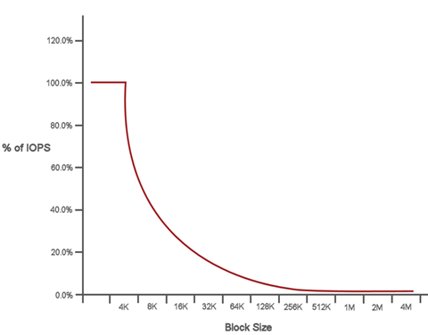

= QoS效能曲線
:allow-uri-read: 
:icons: font
:imagesdir: ../media/

[role="lead"]
服務品質（QoS）效能曲線顯示區塊大小與IOPS百分比之間的關係。

區塊大小和頻寬會直接影響應用程式可取得的IOPS數量。Element軟體會將區塊大小正規化為4K、以考慮其所接收的區塊大小。根據工作負載、系統可能會增加區塊大小。隨著區塊大小增加、系統會將頻寬增加至處理較大區塊大小所需的層級。隨著頻寬增加IOPS、系統也能達到降低的目標。

QoS效能曲線顯示區塊大小增加與IOPS百分比下降之間的關係：

舉例來說、如果區塊大小為4K、頻寬為4000 KB、則IOPS為1000。如果區塊大小增加至8k、頻寬會增加至5000 KB、IOPS則會減少至625。系統將區塊大小納入考量、可確保使用較高區塊大小（例如備份和Hypervisor活動）的較低優先順序工作負載、不會因為使用較小區塊大小的較高優先順序流量而佔用太多效能。
