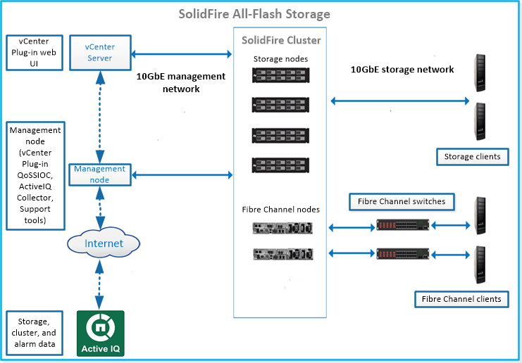

= 儲存系統SolidFire
:allow-uri-read: 
:icons: font
:imagesdir: ../media/

[role="lead"]
包含獨立於每個節點上執行的軟體、將獨立的硬體元件（磁碟機和節點）組合到單一儲存資源池中、而整個儲存系統由不連續的硬體元件組成。SolidFire NetApp Element此統一化叢集可作為單一儲存系統供外部用戶端使用、並透過Element軟體UI、API及其他管理工具、以單一實體的形式進行管理。

使用VMware軟體使用者介面、您可以設定及監控整個多租戶基礎架構的叢集儲存容量和效能、以及管理儲存活動。NetApp Element SolidFire

包含下列元件的完整Flash儲存系統：SolidFire

* 節點：提供叢集儲存資源的實體硬體。節點有兩種類型：
+
** 儲存節點：包含磁碟機集合的伺服器。
** Fibre Channel（FC）節點：用於透過Fibre Channel交換器連接FC用戶端。

* 叢集：SolidFire 由至少四個節點組成的支援中心。
* 管理節點：可讓您升級及提供系統服務、包括監控與遙測、管理叢集資產與設定、執行系統測試與公用程式、以及提供NetApp支援存取權限以進行疑難排解。管理節點（mNode）是與元件軟體型儲存叢集一起執行的虛擬機器。
* 支援以網路為基礎的工具、可持續更新整個叢集資料的歷史檢視。Active IQ您可以針對特定事件、臨界值或度量設定警示。利用此功能、您可以監控系統效能與容量、並隨時掌握叢集健全狀況。Active IQ
* 磁碟機用於儲存節點、並儲存叢集的資料。儲存節點包含兩種磁碟機：
+
** Volume中繼資料磁碟機儲存定義叢集內磁碟區和其他物件的資訊。
** 區塊磁碟機儲存應用程式磁碟區的資料區塊。

