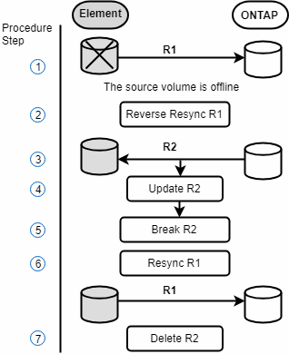
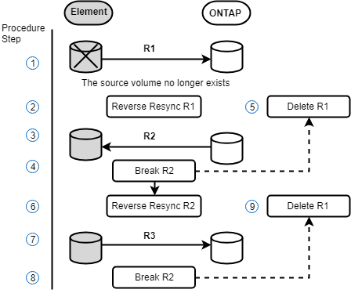

= SnapMirror容錯回復案例
:allow-uri-read: 
:icons: font
:imagesdir: ../media/

[role="lead"]
SnapMirror災難恢復功能可在兩種故障恢復方案中進行說明。這些假設原本的關係已容錯移轉（中斷）。

新增對應程序的步驟以供參考。

NOTE: 在這裡的範例中、R1 =執行NetApp Element 支援的叢集原始來源Volume（Element）是原始ONTAP 來源Volume ONTAP （Element、元素）、而不支援原始目的地Volume（插座）。R2和R3代表透過反轉重新同步作業所建立的反轉關係。

下列影像顯示來源Volume仍存在時的容錯回復案例：

下列影像顯示來源Volume不再存在時的容錯回復案例：

== 如需詳細資訊、請參閱

* xref:task_snapmirror_perform_failback_when_source_volume_exists.adoc[當來源磁碟區仍存在時、請執行容錯回復]
* xref:task_snapmirror_performing_failback_when_source_volume_no_longer_exists.adoc[當來源磁碟區不再存在時、請執行容錯回復]

