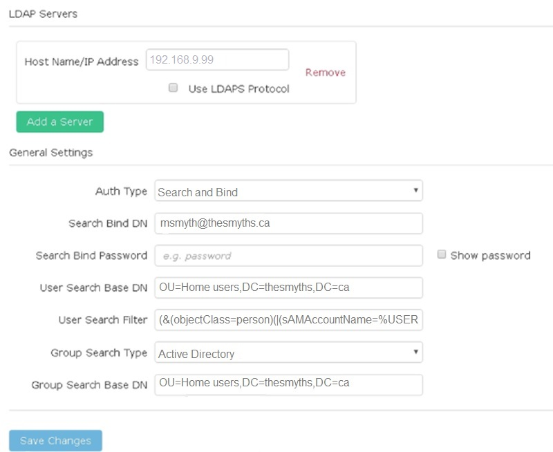
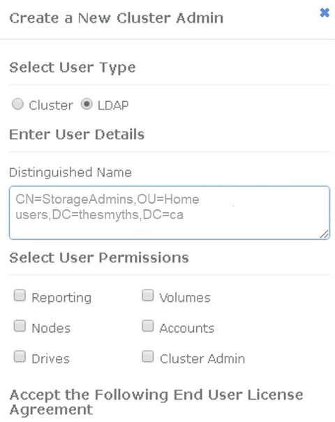

= 管理LDAP
:allow-uri-read: 
:icons: font
:imagesdir: ../media/

[role="lead"]
您可以設定輕量型目錄存取傳輸協定（LDAP）、以啟用SolidFire 安全的目錄型登入功能、以利進行資料儲存。您可以在叢集層級設定LDAP、並授權LDAP使用者和群組。

管理LDAP包括使用SolidFire 現有的Microsoft Active Directory環境、設定LDAP驗證至某個叢集、並測試組態。

NOTE: 您可以同時使用IPv4和IPv6位址。

啟用LDAP涉及下列詳細說明的高層級步驟：

. *完成LDAP支援的預先設定步驟*。驗證您是否擁有設定LDAP驗證所需的所有詳細資料。
. *啟用LDAP驗證*。使用Element UI或Element API。
. *驗證LDAP組態*。或者、您也可以執行GetLdapConfiguration API方法或使用元素UI檢查LTAP組態、檢查叢集是否設定正確的值。
. *測試LDAP驗證*（使用「只讀」使用者）。執行TestLdapAuthentication API方法或使用Element UI來測試LDAP組態是否正確。在這項初始測試中、請使用「只讀」使用者的使用者名稱「s'sAMAccountName'」。這將驗證您的叢集是否已正確設定LDAP驗證、並驗證「只讀」認證和存取是否正確。如果此步驟失敗、請重複步驟1至3。
. *測試LDAP驗證*（使用您要新增的使用者帳戶）。使用您要新增為元素叢集管理員的使用者帳戶重複設定4。複製「識別」名稱（DN）或使用者（或群組）。此DN將在步驟6中使用。
. *新增LDAP叢集admin*（從「測試LDAP驗證」步驟複製並貼上DN）。使用Element UI或AddLdapClusterAdmin API方法、建立具有適當存取層級的新叢集管理使用者。對於使用者名稱、請貼上您在步驟5中複製的完整DN。如此可確保DN格式正確。
. *測試叢集管理存取*。使用新建立的LDAP叢集管理使用者登入叢集。如果您新增了LDAP群組、則可以以該群組中的任何使用者身分登入。

== 完成LDAP支援的預先組態步驟

在元素中啟用LDAP支援之前、您應該先設定Windows Active Directory伺服器、並執行其他的預先設定工作。

.步驟
. 設定Windows Active Directory伺服器。
. *選用：*啟用LDAPS支援。
. 建立使用者和群組。
. 建立唯讀服務帳戶（例如「sfreadonly」）、以用於搜尋LDAP目錄。

== 使用元素使用者介面啟用LDAP驗證

您可以設定儲存系統與現有LDAP伺服器的整合。這可讓LDAP管理員集中管理使用者的儲存系統存取。

您可以使用元素使用者介面或元素API來設定LDAP。本程序說明如何使用Element UI來設定LDAP。

本範例說明如何在SolidFire 列舉的功能上設定LDAP驗證、並使用「實作連結」作為驗證類型。範例使用單一Windows Server 2012 R2 Active Directory伺服器。

.步驟
. 按一下*叢集*>* LDAP *。
. 按一下「*是*」以啟用LDAP驗證。
. 按一下*「新增伺服器*」。
. 輸入*主機名稱/IP位址*。
+

NOTE: 您也可以輸入選用的自訂連接埠號碼。

+
例如、若要新增自訂連接埠號碼、請輸入：

. *選用：*選取*使用LDAPS傳輸協定*。
. 在*一般設定*中輸入必要資訊。
+

. 按一下*啟用LDAP*。
. 如果您要測試使用者的伺服器存取、請按一下*測試使用者驗證*。
. 複製建立叢集管理員時、顯示的辨別名稱和使用者群組資訊、以供日後使用。
. 按一下*儲存變更*以儲存任何新設定。
. 若要在此群組中建立使用者、讓任何人都能登入、請完成下列步驟：
+
.. 按一下*使用者*>*檢視*。
+

.. 對於新使用者、請按一下「使用者類型」的「* LDAP*」、然後將複製的群組貼到「辨別名稱」欄位。
.. 選取權限、通常是所有權限。
.. 向下捲動至「使用者授權合約」、然後按一下「*我接受*」。
.. 按一下「*建立叢集管理*」。
+
現在您的使用者擁有Active Directory群組的值。

若要測試、請登出Element UI、然後以該群組中的使用者身分重新登入。

== 使用Element API啟用LDAP驗證

您可以設定儲存系統與現有LDAP伺服器的整合。這可讓LDAP管理員集中管理使用者的儲存系統存取。

您可以使用元素使用者介面或元素API來設定LDAP。本程序說明如何使用Element API設定LDAP。

若要在SolidFire 某個叢集上運用LDAP驗證、請先使用「EnablLdapAuthentication」API方法在叢集上啟用LDAP驗證。

.步驟
. 使用「EnablLdapAuthentication」API方法、在叢集上先啟用LDAP驗證。
. 輸入所需資訊。
+
[listing]
----
{
     "method":"EnableLdapAuthentication",
     "params":{
          "authType": "SearchAndBind",
          "groupSearchBaseDN": "dc=prodtest,dc=solidfire,dc=net",
          "groupSearchType": "ActiveDirectory",
          "searchBindDN": "SFReadOnly@prodtest.solidfire.net",
          "searchBindPassword": "ReadOnlyPW",
          "userSearchBaseDN": "dc=prodtest,dc=solidfire,dc=net ",
          "userSearchFilter": "(&(objectClass=person)(sAMAccountName=%USERNAME%))"
          "serverURIs": [
               "ldap://172.27.1.189",
          [
     },
  "id":"1"
}
----
. 變更下列參數的值：
+
[cols="2*"]
|===
| 使用的參數 | 說明 

 a| 
驗證類型：SearchAndBind
 a| 
表示叢集將使用唯讀服務帳戶來先搜尋要驗證的使用者、然後在找到並驗證時連結該使用者。

 a| 
群組SearchBaseDN：DC=prodtest,DC=solidfire, DC=net
 a| 
指定LDAP樹狀結構中要開始搜尋群組的位置。在此範例中、我們使用了樹狀結構的根目錄。如果您的LDAP樹狀結構非常大、您可能想要將其設定為更精細的子樹狀結構、以縮短搜尋時間。

 a| 
userSearchBaseDN：DC=prodtest,DC=solidfire, DC=net
 a| 
指定LDAP樹狀結構中要開始搜尋使用者的位置。在此範例中、我們使用了樹狀結構的根目錄。如果您的LDAP樹狀結構非常大、您可能想要將其設定為更精細的子樹狀結構、以縮短搜尋時間。

 a| 
群組搜尋類型：ActiveDirectory
 a| 
使用Windows Active Directory伺服器做為LDAP伺服器。

 a| 
[listing]
----
userSearchFilter:
“(&(objectClass=person)(sAMAccountName=%USERNAME%))”
----
若要使用userPrincipalName（登入電子郵件地址）、您可以將userSearchFilter變更為：

[listing]
----
“(&(objectClass=person)(userPrincipalName=%USERNAME%))”
----
或者、若要同時搜尋userPrincipalName和sAMAccountName、您可以使用下列userSearchFilter：

[listing]
----
“(&(objectClass=person)(
----| （SamAccountName=%username%）（userPrincipalName=%username%））」- 

 a| 
利用sAMAccountName作為我們的使用者名稱來登入SolidFire 到這個叢集。這些設定可讓LDAP在sAMAccountName屬性中搜尋登入時指定的使用者名稱、並將搜尋範圍限制為在objectClass屬性中具有「person」值的項目。
 a| 
searchBindDN

 a| 
這是唯讀使用者的辨別名稱、用於搜尋LDAP目錄。對於Active Directory、通常最容易使用使用者的userPrincipalName（電子郵件地址格式）。
 a| 
searchBindPassword

|===

若要測試、請登出Element UI、然後以該群組中的使用者身分重新登入。

== 檢視LDAP詳細資料

在「叢集」索引標籤的「LDAP」頁面上檢視LDAP資訊。

NOTE: 您必須啟用LDAP才能檢視這些LDAP組態設定。

. 若要檢視含有元素UI的LDAP詳細資料、請按一下*叢集*>* LDAP*。
+
** *主機名稱/IP位址*：LDAP或LDAPS目錄伺服器的位址。
** *驗證類型*：使用者驗證方法。可能值：
+
*** 直接連結
*** 搜尋與連結

** *搜尋連結DN*：完整的DN、可用來登入以執行LDAP搜尋使用者（需要對LDAP目錄的連結層級存取）。
** *搜尋連結密碼*：用於驗證LDAP伺服器存取的密碼。
** *使用者搜尋基礎DN*：用於開始使用者搜尋的樹狀結構基礎DN。系統會從指定位置搜尋子樹狀結構。
** *使用者搜尋篩選器*：使用您的網域名稱輸入下列內容：
+
（&（objectClass =人員）（|（sAMAccountName=%username%）（userPrincipalName=%username%）））））

** *群組搜尋類型*：控制所用預設群組搜尋篩選器的搜尋類型。可能值：
+
*** Active Directory：使用者所有LDAP群組的巢狀成員資格。
*** 無群組：無群組支援。
*** 成員DN：成員DN樣式群組（單層）。

** *群組搜尋基礎DN*：用於開始群組搜尋的樹狀結構基礎DN。系統會從指定位置搜尋子樹狀結構。
** *測試使用者驗證*：設定LDAP之後、請使用此選項來測試LDAP伺服器的使用者名稱和密碼驗證。輸入已存在的帳戶以進行測試。系統將顯示辨別名稱和使用者群組資訊、您可以複製這些資訊以供建立叢集管理員時使用。

== 測試LDAP組態

設定LDAP之後、您應該使用Element UI或Element API「TestLdapAuthentication」方法來測試LDAP。

.步驟
. 若要使用Element UI測試LDAP組態、請執行下列步驟：
+
.. 按一下*叢集*>* LDAP *。
.. 按一下*測試LDAP驗證*。
.. 請使用下表中的資訊解決任何問題：
+
[cols="2*"]
|===
| 錯誤訊息 | 說明 

 a| 
 xLDAPUserNotFound a| 
*** 在設定的「userSearchBaseDN」子樹狀結構中找不到要測試的使用者。
*** 「userSearchFilter」設定不正確。

 a| 
 xLDAPBindFailed (Error: Invalid credentials) a| 
*** 正在測試的使用者名稱是有效的LDAP使用者、但提供的密碼不正確。
*** 正在測試的使用者名稱是有效的LDAP使用者、但帳戶目前已停用。

 a| 
 xLDAPSearchBindFailed (Error: Can't contact LDAP server) a| 
LDAP伺服器URI不正確。

 a| 
 xLDAPSearchBindFailed (Error: Invalid credentials) a| 
唯讀使用者名稱或密碼設定不正確。

 a| 
 xLDAPSearchFailed (Error: No such object) a| 
「userSearchBaseDN」不是LDAP樹狀結構中的有效位置。

 a| 
 xLDAPSearchFailed (Error: Referral) a| 
*** 「userSearchBaseDN」不是LDAP樹狀結構中的有效位置。
*** 「userSearchBaseDN」和「GroupSearchBaseDN」位於巢狀OU中。這可能會導致權限問題。因應措施是在使用者和群組基礎DN項目中加入OU（例如：「ou=storage、n=company、n=com」）

|===

. 若要使用Element API測試LDAP組態、請執行下列步驟：
+
.. 呼叫TestLdapAuthentication方法。
+
[listing]
----
{
  "method":"TestLdapAuthentication",
     "params":{
        "username":"admin1",
        "password":"admin1PASS
      },
      "id": 1
}
----
.. 檢閱結果。如果API呼叫成功、結果會包含指定使用者的辨別名稱、以及使用者所屬群組的清單。
+
[listing]
----
{
"id": 1
     "result": {
         "groups": [
              "CN=StorageMgmt,OU=PTUsers,DC=prodtest,DC=solidfire,DC=net"
         ],
         "userDN": "CN=Admin1 Jones,OU=PTUsers,DC=prodtest,DC=solidfire,DC=net"
     }
}
----

== 停用LDAP

您可以使用Element UI來停用LDAP整合。

在開始之前、您應該記下所有組態設定、因為停用LDAP會清除所有設定。

.步驟
. 按一下*叢集*>* LDAP *。
. 按一下*否*。
. 按一下*停用LDAP*。

== 如需詳細資訊、請參閱

* https://www.netapp.com/data-storage/solidfire/documentation["「元件與元素資源」頁面SolidFire"^]
* https://docs.netapp.com/us-en/vcp/index.html["vCenter Server的VMware vCenter外掛程式NetApp Element"^]

