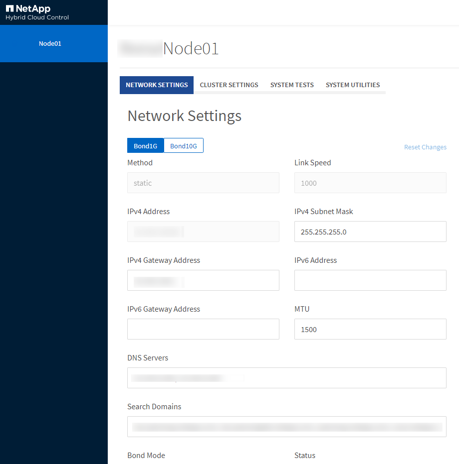

= 使用每個節點的UI存取每個節點的設定
:allow-uri-read: 
:icons: font
:imagesdir: ../media/

[role="lead"]
您可以在輸入管理節點IP並進行驗證之後、存取每個節點使用者介面中的網路設定、叢集設定、以及系統測試和公用程式。

如果您想要修改叢集一部分處於「作用中」狀態的節點設定、則必須以叢集管理員使用者的身分登入。

TIP: 您應該一次設定或修改一個節點。您應該確保指定的網路設定具有預期的效果、而且網路穩定且效能良好、才能對其他節點進行修改。

. 使用下列其中一種方法開啟每個節點的UI：
+
** 在瀏覽器視窗中輸入管理IP位址、然後輸入：4442、然後使用管理使用者名稱和密碼登入。
** 在元素UI中、選取*叢集*>*節點*、然後按一下您要設定或修改之節點的管理IP位址連結。在開啟的瀏覽器視窗中、您可以編輯節點的設定。

+

