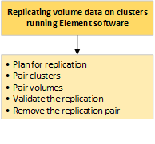

= 在執行NetApp Element 不中斷軟體的叢集之間執行遠端複寫
:allow-uri-read: 
:icons: font
:imagesdir: ../media/

[role="lead"]
對於執行Element軟體的叢集、即時複寫可讓您快速建立Volume資料的遠端複本。您可以將儲存叢集與最多四個其他儲存叢集配對。您可以從叢集配對中的任一叢集同步或非同步複寫磁碟區資料、以進行容錯移轉和容錯回復。

複寫程序包括下列步驟：

* link:task_replication_plan_cluster_and_volume_pairing.html["規劃叢集與Volume配對、以進行即時複寫"]
* link:task_replication_pair_clusters.html["配對叢集以進行複寫"]
* link:task_replication_pair_volumes.html["配對磁碟區"]
* link:task_replication_validate_volume_replication.html["驗證Volume複寫"]
* link:task_replication_delete_volume_relationship_after_replication.html["複寫後刪除磁碟區關係"]
* link:task_replication_manage_volume_relationships.html["管理Volume關係"]

